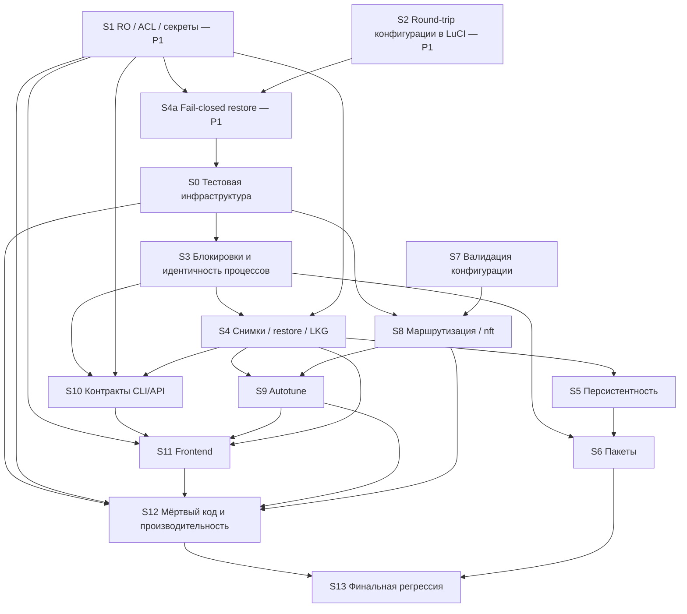

# ULTRACODE MASTER PLAN — генеральный аудит Forkop

**Статус:** PHASE A — DONE. PHASE B — IN PROGRESS (от `main`). Выполнены S1, S2, S4a, S0, S3, SD, S4, S5, S6, S7, S8, S9, S10. Осталось: S11, S12, S13. **Remaining P1 = 0.**

**Исходный коммит аудита:** `078720844608ef4bd9e6971231bacc5870fc9b98` (ветка `feature/observability-safety-ux`).

**Метод:** 17 независимых направлений аудита (read-only, локальные воспроизведения в WSL / ucode / изолированном test runner) → каждая исходная находка P1/P2 перепроверена отдельным агентом, который пытался её опровергнуть и, где возможно, воспроизводил → дедупликация 234 исходных находок (+1 наблюдение baseline) в 190 канонических → независимое ревью плана (критик полноты, порядка и безопасности), принятые правки внесены.

**Приложения:**
- [ULTRACODE_FINDINGS.md](ULTRACODE_FINDINGS.md) — полные карточки всех находок: Evidence, Reproduction, Expected, Actual, Impact, Root cause, Affected files, Dependencies, Proposed fix, Tests needed, Risk, Hardware, вердикт и заметки проверки, дубликаты из других направлений;
- [ULTRACODE_INVENTORIES.md](ULTRACODE_INVENTORIES.md) — карта архитектуры, матрица UCI-опций, матрица блокировок и совместимости операций, контракт CLI/ACL, карта меток и очередей nft, таблица записей на flash, покрытие каталога autotune и Zapret, классификация тестов, проверенные PASS-свойства по каждому направлению.

**Итог в цифрах:** P1 — 5, P2 — 28, P3 — 116, CLEANUP — 34, FUTURE — 7. Все 47 проверенных исходных P1/P2 подтверждены, опровергнутых нет; проверка понизила 5 исходных P2 до P3. Ревью плана повысило 2 находки до P2 и 2 CLEANUP до P3 (помечено в карточках), добавило 10 продуктовых решений и аварийный этап S4a.

---

## 1. Состояние репозитория

Снято 2026-09-28 17:12 MSK, до любых изменений.

| Параметр | Значение |
|---|---|
| Ветка аудита | `ultracode/audit` в отдельном worktree, создан от `origin/feature/observability-safety-ux` |
| Start SHA | `078720844608ef4bd9e6971231bacc5870fc9b98` («Локализация и финальная полировка (6.10)») |
| Relation к origin | в момент старта `ultracode/audit` == `origin/feature/observability-safety-ux` (0 ahead / 0 behind); результат аудита — один docs-коммит поверх, push fast-forward |
| Upstream | `upstream/main` == `origin/main` == tag `1.0.26` (`65787ed4`); fork впереди на Stage 6.x и Autotune 6.8–6.10 |
| Основное рабочее дерево | ветка `feature/observability-safety-ux` на `67ab02ef`, отставала от origin на 28 коммитов; чужие незакоммиченные правки 7 тестов (`components_updater_job`, `dpi_runtime_snapshot`, `full_uninstall_cleanup`, `initd_state`, `list_cache`, `process_identity`, `ui_runtime_job`), untracked `tests/runner/` и 8 каталогов `hardware-validation-*` (evidence). Не тронуты: без reset/pull/stash |
| Параллельная работа | отдельная сессия: worktree с веткой `audit/stage6-hardware-validation` (`e7b48d77`, отчёт `docs/audit/STAGE6_HARDWARE_VALIDATION.md` — проверка этого же SHA на GL-MT6000). Её дерево, ветка и evidence не трогались; её выводы (P2 upgrade и 10 P3 UI) учтены в аудите и сверены с кодом |
| Git identity | коммиты — только `Asofwar <7397608+Asofwar@users.noreply.github.com>`, без AI-атрибуции |

---

## 2. Baseline

Все проверки — на `07872084`, до изменений.

| Область | Результат | Как получено |
|---|---|---|
| Frontend prettier | PASS | `tests/runner` (локальный параллельный раннер, lane frontend), Windows node 24 |
| Frontend eslint `--max-warnings=0` | PASS, 0 warnings | там же |
| Frontend tsc `--noEmit` | PASS | там же |
| Frontend vitest | PASS: 63 файла / 715 тестов | там же |
| Frontend build | PASS: `yarn build && yarn format:js` даёт `main.js`, побайтно равный закоммиченному | одноразовый worktree, удалён после проверки |
| Локализация | PASS: `locales:actualize` меняет только дату POT и порядок ссылок; 1210 msgid, непереведённых нет | там же |
| Backend `tests/*.sh` | **154 / 154 PASS** в WSL-native клоне с git-историей; 153 / 154 в worktree на `/mnt/c` (см. средовые сбои) | `tests/runner/run.sh --lanes backend`, изоляция user/mount/pid/net namespace |
| ucode syntax (`-c`, `-S -c`) | PASS: 84 файла × 2 | lane syntax (ucode CI-версии v0.0.20250529) |
| shellcheck `--severity=error` | PASS: набор файлов CI | lane shell |
| JSON | PASS: 9 tracked JSON валидны | скрипт проверки |
| UTF-8 | PASS: 624 текстовых файла, без BOM и CRLF | скрипт проверки |
| `git diff --check 65787ed4..HEAD` | 1 срабатывание — намеренные пробелы в фикстуре `tests/readonly_dpi_strategy.sh:28` | git |
| Autotune (contract, isolation, select, apply, state, groups, hysteresis, scheduler, autoapply, recovery, manual_apply) | PASS (входят в 154) | backend lane |
| ACL / read-only / маскировка (`acl_boundary`, `luci_readonly_view`, `luci_readonly_command_guard`, `readonly_dpi_strategy`, `config_snapshots`, `diagnostics_status`) | PASS (входят в 154). Существующие тесты не ловят [UC-001](ULTRACODE_FINDINGS.md#uc-001) и [UC-002](ULTRACODE_FINDINGS.md#uc-002) — пробелы покрытия, а не регрессия | backend lane |
| OpenWrt 24.10 / 25.12 LuCI | **PASS / PASS.** Пакеты `1.0.26-90`, собранные `build.sh` из этого SHA (IPK для 24.10.8, APK для 25.12.5), установлены с `luci-i18n-base-ru`, язык интерфейса — русский. 6 страниц × 1440/1024/768 × admin/RO: все 33 ожидаемые страницы загрузились, «Loading view…» не зависает, 0 JS-исключений и `console.error`, горизонтальный overflow 0 px. RO: 0 мутирующих RPC при первичной отрисовке (единственный отказ — ожидаемый `uci.get forkop`), Settings скрыт в меню, прямой URL — HTTP 403. ucode 2025.07.18 (24.10) и 2026.01.16 (25.12): все 85 файлов компилируются (`-c` и `-S -c`). 11 read-only CLI-команд: rc 0, JSON валиден (кроме текстового `show_version`), stderr пуст. Ограничения: контейнер x86-64, конфигурация по умолчанию без правил, sing-box/zapret/byedpi не установлены (служба остановлена), проверяется только первичная отрисовка. Побочные наблюдения: postinst пакета `forkop` в контейнере вернул 1 — на зеркале нет платформы x86/64, `package_postinst` пропущен (независимое подтверждение расширенного триггера [UC-026](ULTRACODE_FINDINGS.md#uc-026)); сборка не побитово воспроизводима (три сборки одного SHA — три разных sha256; [UC-190](ULTRACODE_FINDINGS.md#uc-190)); UI опрашивает `get_ui_state` ~1,16 раза в секунду (стоимость опроса — [UC-146](ULTRACODE_FINDINGS.md#uc-146), S12) | контейнеры `openwrt/rootfs:x86-64-24.10.8` и `x86-64-25.12.5`, headless Edge |
| Hardware | NOT TESTED в этой сессии. Параллельная сессия проверила этот же SHA на GL-MT6000 (OpenWrt 25.12.5): PARTIAL (P2 upgrade + 10 P3 UI, мутации конфигурации не разрешались) | отчёт `docs/audit/STAGE6_HARDWARE_VALIDATION.md` в ветке `audit/stage6-hardware-validation` |

**Известные средовые сбои (с доказательством):**
1. `config_contract_matrix` в worktree на `/mnt/c`: `FAIL: stable baseline is unavailable: tag 0.7.19.9 or commit 68d516e…`. Файл `.git` worktree содержит Windows-путь, WSL-git его не разрешает, раннер пишет «not a git checkout, running in place». **Доказательство:** тот же тест того же SHA `07872084` в WSL-native клоне (tag `0.7.19.9` = `99a6042f`) — PASS; код не менялся.
2. `list_cache` вне изолированного раннера на WSL (где `/tmp` ≈ 1 ТБ) падает: тест предполагает, что на хосте меньше ~931 GiB свободного места. В раннере с tmpfs `/tmp` — PASS (этот baseline). Модуль корректен; тестовый дефект — в плане S0.
3. Пять тестов `autotune_*` требуют OpenWrt `uci` CLI (есть в WSL: `~/.local/openwrt-uci/bin`). В GitHub backend CI его нет — там они падают всегда (не средовая особенность этой машины, а дефект CI: [UC-009](ULTRACODE_FINDINGS.md#uc-009)).

---

## 3. Карта архитектуры

Подробная карта модулей, путей состояния, фронтенда и пакетов — в [ULTRACODE_INVENTORIES.md](ULTRACODE_INVENTORIES.md), раздел A1.

**Backend.** 84 ucode-модуля в `/usr/lib/forkop` и диспетчер `/usr/bin/forkop` (ucode, 89 команд в `command_spec`: модуль, режим, фиксированное число аргументов, shell-quoting каждого аргумента; блокировка мутаций на время полного удаления). Граф `require` без циклов; модули в основном вызывают друг друга дочерними процессами `ucode -L lib module.uc <mode>`. Многие пути и бинарники переопределяются переменными окружения (для тестов) — см. [UC-001](ULTRACODE_FINDINGS.md#uc-001).

**Lifecycle.** `/etc/init.d/forkop` — procd-служба без instance: `start_service → initd.uc start-service` (при старте из rcS отсоединяется от procd fd 1000) `→ forkop start → lifecycle.uc`. Порядок старта: validator → списки и подписки → кандидат nft (один батч, `nft -c`, затем `nft -f`) → sing-box (через управляемый `/etc/init.d/sing-box`, владелец = procd pid + start ticks) → DPI-провайдеры → dnsmasq → воркеры → confirm-working (LKG). Reload сериализуется `/var/run/forkop.reload.lock` + очередь `reload.pending`. Под procd работают только sing-box и TorrServer Direct; DPI-супервизоры, воркеры и async-задачи — фоновые `sh -c … &` с pidfile (pid + start ticks через `core/process_identity.uc`; исключения — [UC-014](ULTRACODE_FINDINGS.md#uc-014)).

**Данные.** UCI `/etc/config/forkop` → `config/validator.uc`, `config/migration.uc` → `singbox/generator.uc` (JSON sing-box) → `nft/apply.uc` (ForkopTable, TPROXY, метки, ip rule 105 / table 105) → `dns/apply.uc` (dnsmasq → DNS sing-box, FakeIP 198.18.0.0/15) → рантайм → `diagnostics/*`, Monitoring (наблюдаемая цепочка sing-box). Канонический резолвер владельца маршрута — `routing/resolve.uc` (first-match по сгенерированным правилам; недоказуемое → `undecidable`); им пользуются route_trace и autotune groups/plan/verify.

**Восстановление.** `config/snapshots.uc`: снимки в `/etc/forkop/config-snapshots` (0600, замена через rename, RETENTION=10, LKG = `last-known-working`), restore через `init.d reload` под restore-guard (nft-таблица, дропающая DPI-трафик до подтверждения рантайма), журнал `history.jsonl` (flash, ≤200 записей / 64 KiB). Autotune Stage 5 (`autotune/apply.uc`) — единственный движок мутации DPI-стратегии: plan → before-снимок → apply через транзакцию snapshots → production-проверка → откат; вызывается только из `manager.uc apply_group` (расписание 6.8.5 и ручное применение 6.9.1).

**Autotune.** catalog (8 TCP-кандидатов) → contract/validator → isolation (собственная nft-таблица, probe-метка 0x08000000, очереди 4600–4607, source-порты 61000–61031) → probe (curl) → select (стабильность ≥0.8) → groups (владелец через resolve.uc, конфликты не разрешаются) → state (`/etc/forkop/autotune/state.json`, атомарная запись только при изменении — кроме [UC-075](ULTRACODE_FINDINGS.md#uc-075)) → hysteresis → scheduler (cron + неблокирующий flock) → recommendation → apply (Stage 5).

**Frontend.** TypeScript `fe-app-forkop/src` → tsup-бандл `luci-app-forkop/.../main.js` (побайтно воспроизводим). Stage 6: отдельные LuCI-страницы меню (Overview, Monitoring, Diagnostics, Autotune, History & Recovery, Settings) + рукописные `section.js` / `settings.js` (редактор правил и настроек на LuCI form). Backend вызывается только через `fs.exec('/usr/bin/forkop', …)`, `fs.read` файлов задач и прямой HTTP/WebSocket к Clash API (с fallback на опрос через rpcd). Read-only: ACL-группа `read` с поштучным allow-list argv (F-001) + зеркальный фронтенд-guard `readonlyCommandGuard.ts`.

**Пакеты.** `build.sh` собирает IPK (24.10, opkg) и APK (25.12, apk) для `forkop`, `luci-app-forkop`, `luci-i18n-forkop-ru`; `forkop/Makefile` — второй (SDK) рецепт. Maintainer-скрипты: prerm останавливает службу и оставляет `/tmp/forkop-package-was-running`; postinst: `migration.uc migrate` → `mirror-migration.sh` → `forkop package_postinst` (перезапуск).

**Тесты.** 154 bash-теста `tests/*.sh` (ucode + заглушки OpenWrt-утилит; классификация — в приложении), 3 теста `tests/router` (нужен роутер), 63 файла / 715 тестов vitest.

---

## 4. Находки

### 4.1 P1 — кратко

| ID | Что | Почему P1 | Минимальное исправление | Этап |
|---|---|---|---|---|
| [UC-001](ULTRACODE_FINDINGS.md#uc-001) | rpcd `file.exec` принимает таблицу `env` от вызывающего без фильтрации, а backend берёт пути бинарников и файлов из окружения (`FORKOP_*`, `FORKOP_LIB`, `UCI_STATE`/`UCI_LOG`, `TMP_*`, `SB_*`, `NFT_*`, `ZAPRET_*`, `BYEDPI_BIN`, `DNSMASQ_INIT`, `PATH`). Read-only сессия запускает существующий бинарник с аргументом `version`, читает любой файл через `global_check masked` (`FORKOP_CONFIG=/etc/shadow`), затирает любой файл JSON-выводом | Граница read-only (F-001), инварианты 1 и 2; подтверждено по исходникам rpcd и воспроизведением CLI. Условие: делегированная RO-учётная запись (модель угроз F-001) | RO-обёртка `/usr/libexec/forkop-ro` (`env -i`, фиксированный PATH); на неё переводятся все read-записи ACL и фронтенд-guard. Защита — именно `env -i`, а не фильтрация по префиксу | S1 |
| [UC-002](ULTRACODE_FINDINGS.md#uc-002) | `global_check masked` (разрешён read-only) печатает без маскировки `list outbound_jsons` (пароли, UUID, private_key; туда же миграция переносит `user:pass` из http-ссылок), WAN-учётки l2tp/pptp/3g, токены в URL списков и путь DoH | Инвариант 2; воспроизведено на фикстуре | маскировать `list outbound_jsons` (включая многострочное продолжение), WAN-учётки любого proto, userinfo/query URL — одинаково в `status.uc` и `maskDiagnostics.ts`; далее — allowlist вместо denylist | S1 |
| [UC-003](ULTRACODE_FINDINGS.md#uc-003) | Редактор правила стирает фильтр устройств `source_ip_cidr`, когда условия правила заданы только Built-in rule sets #2 или legacy remote lists (нет в `routingConditions`, нет `retain`): правило «для одного устройства» молча становится правилом для всех | Тихая потеря конфигурации, расширение маршрутизации/блокировки на всю LAN; воспроизведено на реальном `section.js` | добавить `secondary_rule_sets` в список условий + `retain` для поля устройств | S2 |
| [UC-004](ULTRACODE_FINDINGS.md#uc-004) | Модалка «Включить IP-адреса и подсети» для пользовательского rule set перезаписывает `rule_set_with_subnets` только пользовательскими ссылками и удаляет все Built-in rule sets #2 | Тихая потеря условий маршрутизации; воспроизведено | при сохранении сохранять вторичные (b4geoip) ссылки | S2 |
| [UC-005](ULTRACODE_FINDINGS.md#uc-005) | `snapshots.uc` restore считает успешным reload, который `initd.uc` лишь поставил в очередь (lock занят обновлением списков/подписки, WAN-up, start): LKG переносится на непроверенный конфиг, restore-guard снимается, UI и история пишут «восстановлено» | Инварианты 3, 4, 5, 15; воспроизведено с реальным `initd.uc reload-service` | детерминированный сигнал из `initd.uc reload_service`: для причин restore и autotune печатается токен `queued`, `snapshots.uc` считает его невыполненным reload в обоих режимах → rollback / needs_attention с сохранённым guard; pre-check `busy` до мутаций (как autotune `service_action`); уникальный маркер pending — только дополнительная защита | S4a |

Активных P1, делающих дальнейший аудит опасным, не было: все P1 требуют действия пользователя/администратора или делегированной read-only учётной записи; аудит их не эксплуатировал.

### 4.2 Сводная таблица всех находок

Колонка «Проверка» — вердикт независимого верификатора (только для исходных P1/P2). Полные карточки — в [ULTRACODE_FINDINGS.md](ULTRACODE_FINDINGS.md) по ссылке с ID. Порядок: severity, затем порядок выполнения этапов.

| ID | Sev | Этап | Находка | Решение | Проверка |
|---|---|---|---|---|---|
| [UC-001](ULTRACODE_FINDINGS.md#uc-001) | P1 | S1 | rpcd file.exec принимает окружение от вызывающего: read-only роль через FORKOP_* запускает бинарники и читает/пишет файлы от root |  | confirmed → P1 |
| [UC-002](ULTRACODE_FINDINGS.md#uc-002) | P1 | S1 | global_check masked (доступен read-only) раскрывает list outbound_jsons, WAN-учётки l2tp/pptp и токены в URL списков |  | confirmed → P1 |
| [UC-003](ULTRACODE_FINDINGS.md#uc-003) | P1 | S2 | Редактор правила стирает фильтр устройств (source_ip_cidr), если условия заданы только Built-in rule sets #2 или legacy remote lists |  | confirmed → P1 |
| [UC-004](ULTRACODE_FINDINGS.md#uc-004) | P1 | S2 | Модалка настроек rule set («Включить IP и подсети») удаляет из правила все Built-in rule sets #2 |  | confirmed → P1 |
| [UC-005](ULTRACODE_FINDINGS.md#uc-005) | P1 | S4a | Восстановление снимка при reload, поставленном в очередь, объявляет успех, переносит LKG и снимает restore guard |  | confirmed → P1 |
| [UC-006](ULTRACODE_FINDINGS.md#uc-006) | P2 | S1 | Маскированный конфиг sing-box оставляет секретные поля (pre_shared_key, auth, headers, path, plugin_opts, токены URL) |  | confirmed → P2 |
| [UC-007](ULTRACODE_FINDINGS.md#uc-007) | P2 | S1 | Clash API по умолчанию слушает LAN-адрес без секрета: любой хост LAN и read-only пользователь управляют прокси и видят соединения | D-1 | confirmed → P2 |
| [UC-008](ULTRACODE_FINDINGS.md#uc-008) | P2 | S2 | Списки выбора, отфильтрованные по доступности, теряют сохранённое значение: сохранение правила меняет action на Connection, удаляет DPI-стратегию и перенаправляет ссылки на другие секции |  | confirmed → P2 |
| [UC-009](ULTRACODE_FINDINGS.md#uc-009) | P2 | S0 | Backend CI без uci CLI: 5 тестов autotune всегда падают без вывода и блокируют release | D-5 | confirmed → P2 |
| [UC-010](ULTRACODE_FINDINGS.md#uc-010) | P2 | S3 | Отложенный start из init.d регистрирует PID завершающейся оболочки rc.common владельцем reload.lock — сериализация start/reload не работает |  | confirmed → P2 |
| [UC-011](ULTRACODE_FINDINGS.md#uc-011) | P2 | S3 | Каталоговый lock без записанного pid считается устаревшим, release безусловный — два процесса одновременно держат reload.lock |  | confirmed → P2 |
| [UC-012](ULTRACODE_FINDINGS.md#uc-012) | P2 | S3 | stop не сериализован с держателями reload.lock: обновление подписки или DNS-failover поднимают sing-box после остановки |  | confirmed → P2 |
| [UC-013](ULTRACODE_FINDINGS.md#uc-013) | P2 | S3 | /etc/init.d/forkop start\|restart всегда возвращает 0 — откаты и fallback по коду возврата не срабатывают |  | confirmed → P2 |
| [UC-014](ULTRACODE_FINDINGS.md#uc-014) | P2 | S3 | Воркеры останавливаются по голому PID: SIGTERM чужому процессу из устаревшего pidfile; переиспользованный PID блокирует обновления и повторы |  | confirmed → P2 |
| [UC-015](ULTRACODE_FINDINGS.md#uc-015) | P2 | S3 | Команда `forkop main` вызывает start_main() в обход защит start_inner и пересобирает рабочую таблицу nft |  | confirmed → P2 |
| [UC-016](ULTRACODE_FINDINGS.md#uc-016) | P2 | S3 | curl к Clash API без таймаутов: зависший контроллер блокирует опрос UI и проверку reload/start |  | confirmed → P2 |
| [UC-017](ULTRACODE_FINDINGS.md#uc-017) | P2 | S4 | Автоматический откат autotune после неудачной проверки перезаписывает изменения конфигурации, сделанные во время проверки |  | confirmed → P2 |
| [UC-018](ULTRACODE_FINDINGS.md#uc-018) | P2 | S4 | Diff снимков теряет или приписывает не той секции изменения в анонимных секциях UCI — предпросмотр пишет «Нет сохранённых изменений» |  | confirmed → P2 |
| [UC-019](ULTRACODE_FINDINGS.md#uc-019) | P2 | S4 | Оставленный lifecycle DPI guard делает восстановление ненадёжным: DPI-восстановление всегда падает, остальные сообщают успех при активном guard |  | confirmed → P2 |
| [UC-020](ULTRACODE_FINDINGS.md#uc-020) | P2 | S4 | Сбой между reload и проверкой autotune оставляет непроверенного кандидата; следующий start/reload делает его LKG, отката нет |  | confirmed → P2 |
| [UC-021](ULTRACODE_FINDINGS.md#uc-021) | P2 | S4 | Карточка «Восстановление» в Обзоре пишет «Не требуется» при незавершённом восстановлении, а при недоступном health — «исправно» |  | confirmed → P2 |
| [UC-022](ULTRACODE_FINDINGS.md#uc-022) | P2 | S4 | Десять ручных снимков блокируют restore, снимки pre-restore/LKG и autotune; отказ показывается как общая ошибка и записывается как 'restore failure' | D-14 | — |
| [UC-023](ULTRACODE_FINDINGS.md#uc-023) | P2 | S4 | Откат restore перезаписывает правки конфигурации, закоммиченные во время (долгого) reload цели и не попавшие ни в один снимок |  | — |
| [UC-024](ULTRACODE_FINDINGS.md#uc-024) | P2 | S5 | Ошибки set/commit UCI считаются успехом (core/uci.uc сравнивает с false, dns/apply.uc игнорирует результат) |  | confirmed → P2 |
| [UC-025](ULTRACODE_FINDINGS.md#uc-025) | P2 | S5 | Критичные файлы на flash заменяются rename без sync: на UBIFS сбой питания оставляет config, снимки и запись apply нулевой длины |  | confirmed → P2 |
| [UC-026](ULTRACODE_FINDINGS.md#uc-026) | P2 | S6 | Обновление пакета оставляет Forkop остановленным, если mirror-migration.sh упал (зеркало недоступно или платформы нет в индексе) |  | confirmed → P2 |
| [UC-027](ULTRACODE_FINDINGS.md#uc-027) | P2 | S6 | Установка/обновление Forkop из интерфейса останавливает службу до проверок и оставляет её остановленной при отказе или ошибке |  | confirmed → P2 |
| [UC-028](ULTRACODE_FINDINGS.md#uc-028) | P2 | S6 | Удаление пакета и полное удаление игнорируют отказ остановки и оставляют ForkopTable, ip rule 105 и cron |  | confirmed → P2 |
| [UC-029](ULTRACODE_FINDINGS.md#uc-029) | P2 | S8 | Приоритетное bypass-правило только по портам пропускает FakeIP-адреса без tproxy-метки — трафик теряется |  | confirmed → P2 |
| [UC-030](ULTRACODE_FINDINGS.md#uc-030) | P2 | S8 | ByeDPI-правило с IP, подсетями или портами зацикливает собственные соединения ciadpi через TPROXY обратно в sing-box | D-8 | confirmed → P2 |
| [UC-031](ULTRACODE_FINDINGS.md#uc-031) | P2 | S9 | Политика по умолчанию (probes=5) превышает бюджет портов изоляции — каждый запуск autotune отказывает too_many_probes | D-4 | confirmed → P2 |
| [UC-032](ULTRACODE_FINDINGS.md#uc-032) | P2 | S9 | Рекомендацию для правила со стратегией не «один профиль TCP/443» применить нельзя, но UI показывает «подтверждена» и «Применить» | D-7 | confirmed → P2 |
| [UC-033](ULTRACODE_FINDINGS.md#uc-033) | P2 | S10 | Асинхронный тест задержки одного прокси передаёт путь файла задачи как URL теста и сообщает успех |  | confirmed → P2 |
| [UC-034](ULTRACODE_FINDINGS.md#uc-034) | P3 | S1 | RO ACL выдаёт неиспользуемые и относительно мощные команды (check_proxy, тройка latency-команд clash_api и др.) |  | — |
| [UC-035](ULTRACODE_FINDINGS.md#uc-035) | P3 | S1 | Предикат авторизации Clash API расходится: генератор ставит secret при enable_yacd, backend шлёт Authorization только при WAN-доступе; выключение WAN-доступа стирает секрет, который продолжает действовать в LAN |  | — |
| [UC-036](ULTRACODE_FINDINGS.md#uc-036) | P3 | S1 | Секрет Clash API выводится в консоль браузера; логгер хранит неограниченный буфер в памяти |  | — |
| [UC-037](ULTRACODE_FINDINGS.md#uc-037) | P3 | S1 | Сгенерированный конфиг sing-box записывается с правами чтения для всех (секреты в /etc/sing-box/config.json и /tmp) |  | — |
| [UC-038](ULTRACODE_FINDINGS.md#uc-038) | P3 | S1 | Валидатор допускает доступ к Clash API из WAN с пустым секретом (UI это запрещает, бэкенд — нет) |  | — |
| [UC-039](ULTRACODE_FINDINGS.md#uc-039) | P3 | S1 | ИЗВЕСТНО (HW-проверка, P3): Overview в режиме только чтения показывает теги outbound, так как get_readonly_config_sections отбрасывает имена дочерних элементов |  | — |
| [UC-040](ULTRACODE_FINDINGS.md#uc-040) | P3 | S2 | Временный сбой бэкенд-валидатора кэшируется на время жизни страницы как невалидная стратегия и блокирует сохранение |  | — |
| [UC-041](ULTRACODE_FINDINGS.md#uc-041) | P3 | S2 | Скрытые опции каскада сохраняются, но их нельзя очистить из LuCI, поэтому ошибки валидации невозможно исправить | D-22 | — |
| [UC-042](ULTRACODE_FINDINGS.md#uc-042) | P3 | S2 | Устаревшие списковые опции remote_domain_lists/remote_subnet_lists/local_* не видны в LuCI; валидатор и генератор трактуют их по-разному | D-6 | — |
| [UC-043](ULTRACODE_FINDINGS.md#uc-043) | P3 | S2 | Устаревшие условия text-mode / *_text и устаревший `list interfaces`: UI показывает или сохраняет не те значения, которые использует бэкенд | D-6 | — |
| [UC-044](ULTRACODE_FINDINGS.md#uc-044) | P3 | S2 | Тег URLTest outbound включает зависящий от позиции анонимный UCI id групп URLTest, созданных из UI |  | — |
| [UC-045](ULTRACODE_FINDINGS.md#uc-045) | P3 | S2 | Вложенные модальные окна элементов сразу пишут в UCI; закрытие модального окна правила их не откатывает |  | — |
| [UC-046](ULTRACODE_FINDINGS.md#uc-046) | P3 | S2 | Виджет 'Built-in rule sets #2' показывается для DNS-правил, но его выбор молча отбрасывается |  | — |
| [UC-047](ULTRACODE_FINDINGS.md#uc-047) | P3 | S4a | Обнаружение поставленного в очередь reload в режиме apply autotune не срабатывает: маркер pending имеет разрешение в одну секунду |  | — |
| [UC-048](ULTRACODE_FINDINGS.md#uc-048) | P3 | S0 | Фильтры путей backend CI пропускают изменения в luci-app-forkop/** и fe-app-forkop/**, хотя 31 backend-тест (включая границу RO ACL) читает эти файлы | D-5 | — |
| [UC-049](ULTRACODE_FINDINGS.md#uc-049) | P3 | S0 | list_cache.sh зависит от хоста: TMP_SING_BOX_FOLDER не изолирован, а кейс '/tmp capacity' предполагает, что на ФС хоста свободно меньше ~931 GiB | D-9 | — |
| [UC-050](ULTRACODE_FINDINGS.md#uc-050) | P3 | S0 | config_contract_matrix требует историю git и может делать fetch из origin, записывая тег в репозиторий разработчика |  | — |
| [UC-051](ULTRACODE_FINDINGS.md#uc-051) | P3 | S0 | Гонки fork/exec и фиксированных sleep в тестах (чужой незакоммиченный diff исправляет 7 файлов, остальные остаются) | D-9 | — |
| [UC-052](ULTRACODE_FINDINGS.md#uc-052) | P3 | S0 | Реальный nft доступен, но не используется: все заглушки nft принимают любой синтаксис, а nft_apply.sh тестирует только режим argv, хотя production всегда применяет batch-файл |  | — |
| [UC-053](ULTRACODE_FINDINGS.md#uc-053) | P3 | S3 | Очистка осиротевших процессов изоляции может отправить SIGTERM/SIGKILL чужому nfqws с совпадающей сигнатурой до отказа по queue_in_use |  | — |
| [UC-054](ULTRACODE_FINDINGS.md#uc-054) | P3 | S3 | Инверсия порядка блокировок: start берёт reload.lock, затем subscription-update.lock, обновление подписки — в обратном порядке (латентно, пока есть баг detached-start) |  | — |
| [UC-055](ULTRACODE_FINDINGS.md#uc-055) | P3 | S3 | flock воркера autotune наследуют все потомки, включая перезапущенные reload при apply супервизоры zapret; после падения менеджера autotune занят, а мёртвый запуск числится активным |  | — |
| [UC-056](ULTRACODE_FINDINGS.md#uc-056) | P3 | S3 | Reload остановленного runtime молча запускает Forkop, а stop оставляет триггеры reload (воркеры ruleset-refresh, reload.pending), поэтому остановка пользователем не сохраняется | D-15 | — |
| [UC-057](ULTRACODE_FINDINGS.md#uc-057) | P3 | S3 | Глобальный reload.lock удерживается во время долгого сетевого I/O (обновление списков и подписок), блокируя применение DNS-failover и восстановление runtime |  | — |
| [UC-058](ULTRACODE_FINDINGS.md#uc-058) | P3 | S3 | Очистка устаревшего nfqws убивает любой процесс, чья строка `ps w` содержит устаревший путь (две копии, выполняется при каждом start/reload) |  | — |
| [UC-059](ULTRACODE_FINDINGS.md#uc-059) | P3 | S4 | Если reload восстановления при откате autotune падает, LKG переносится на кандидата, только что не прошедшего проверку в production |  | confirmed → P3 |
| [UC-060](ULTRACODE_FINDINGS.md#uc-060) | P3 | S4 | История: каждый apply autotune пишет два события autotune_apply (первое сообщает об успехе до проверки); откат записывается как 'restore' вопреки дизайну H.6 |  | — |
| [UC-061](ULTRACODE_FINDINGS.md#uc-061) | P3 | S4 | Reload службы из UI сообщает 'completed', хотя init.d только поставил reload в очередь |  | — |
| [UC-062](ULTRACODE_FINDINGS.md#uc-062) | P3 | S4 | config_snapshot_diff молча обрезает список на 100 изменениях; подтверждение восстановления занижает объём изменений |  | — |
| [UC-063](ULTRACODE_FINDINGS.md#uc-063) | P3 | S4 | Diff снимка показывает *** для опции, отсутствующей в одной из сторон (известный пункт HW-проверки) | D-2 | — |
| [UC-064](ULTRACODE_FINDINGS.md#uc-064) | P3 | S4 | Хук 'snapshot-first Save & Apply' в Settings — мёртвый код: LuCI никогда не вызывает forkopMap.handleSaveApply |  | confirmed → P3 |
| [UC-065](ULTRACODE_FINDINGS.md#uc-065) | P3 | S4 | Восстановление снимка History от старого релиза обходит миграцию конфигурации (возвращаются выведенные mirror/rulesets; applied_migrations откатывается) | D-16 | confirmed → P3 |
| [UC-066](ULTRACODE_FINDINGS.md#uc-066) | P3 | S4 | UI восстановления показывает события needs_attention и failed как 'In progress' и не даёт указаний по восстановлению |  | — |
| [UC-067](ULTRACODE_FINDINGS.md#uc-067) | P3 | S4 | Снимок 'before-reload' подписан 'Before applying changes', но содержит новую, возможно сбойную конфигурацию |  | — |
| [UC-068](ULTRACODE_FINDINGS.md#uc-068) | P3 | S4 | Restore игнорирует staged (незакоммиченные) изменения UCI: reload проверяет цель плюс staged-дельты, а LKG фиксирует чистую цель |  | — |
| [UC-069](ULTRACODE_FINDINGS.md#uc-069) | P3 | S4 | Нечитаемый autotune-apply.json трактуется как отсутствие записанного apply (fail open): пропадают needs_attention и путь отката |  | — |
| [UC-070](ULTRACODE_FINDINGS.md#uc-070) | P3 | S5 | config.json sing-box публикуется неатомарно через `mv` между файловыми системами (unlink + копирование) и перезаписывается при каждом переходе DNS-failover |  | — |
| [UC-071](ULTRACODE_FINDINGS.md#uc-071) | P3 | S5 | Откат reload dnsmasq перезаписывает /etc/config/dhcp целиком через `cp` из бэкапа (неатомарно, в обход блокировки UCI, с потерей параллельных правок dhcp) |  | — |
| [UC-072](ULTRACODE_FINDINGS.md#uc-072) | P3 | S5 | Постоянный кэш списков (flash, до 8 MiB) полностью перезаписывается при каждом успешном обновлении, даже без изменений; у интервала нет нижней границы |  | — |
| [UC-073](ULTRACODE_FINDINGS.md#uc-073) | P3 | S5 | history.jsonl: оборванная последняя строка поглощает следующее записанное событие; дозапись и ротация выполняются без блокировки |  | — |
| [UC-074](ULTRACODE_FINDINGS.md#uc-074) | P3 | S5 | Восстановление состояния autotune переименовывает повреждённый файл до записи замены; сбой записи теряет recovered_at (cooldown) и бюджет apply |  | — |
| [UC-075](ULTRACODE_FINDINGS.md#uc-075) | P3 | S5 | Воркер autotune дважды каждые 15 минут перезаписывает state.json на flash, пока заблокирован (например, needs_attention) |  | — |
| [UC-076](ULTRACODE_FINDINGS.md#uc-076) | P3 | S5 | Общие системные файлы перезаписываются на месте (rt_tables, фиды пакетов); откат зеркала игнорирует ошибки и всегда сообщает об успехе |  | — |
| [UC-077](ULTRACODE_FINDINGS.md#uc-077) | P3 | S6 | Восстановление при отсутствующем/пустом конфиге в package_postinst недостижимо: предшествующие шаги миграции и миграции зеркала падают без конфига |  | — |
| [UC-078](ULTRACODE_FINDINGS.md#uc-078) | P3 | S6 | Аварийное восстановление dnsmasq в package.uc запускает `ucode dns/apply.uc` без -L и всегда падает (No module named 'core.uci') |  | — |
| [UC-079](ULTRACODE_FINDINGS.md#uc-079) | P3 | S6 | Полное удаление оставляет /etc/forkop-backups/configuration.tar.gz (полный конфиг с секретами), хотя UI обещает удалить настройки | D-10 | — |
| [UC-080](ULTRACODE_FINDINGS.md#uc-080) | P3 | S6 | Остаток F-008: путь по умолчанию 'install latest' в приложении по-прежнему ставит пакеты без проверки SHA-256 |  | — |
| [UC-081](ULTRACODE_FINDINGS.md#uc-081) | P3 | S6 | Каждая установка/обновление пакета Forkop молча переключает официальные фиды OpenWrt на зеркало и заново доверяет его ключу, даже если пользователь вернул официальные фиды | D-3 | — |
| [UC-082](ULTRACODE_FINDINGS.md#uc-082) | P3 | S6 | Два рецепта сборки пакетов разошлись: forkop/Makefile (SDK) не ставит forkop-torrserver-direct и имеет иную семантику скриптов пакета, чем build.sh | D-21 | — |
| [UC-083](ULTRACODE_FINDINGS.md#uc-083) | P3 | S6 | Удаление пакета и полное удаление не останавливают и не отключают forkop-torrserver-direct; ссылки в rc.d остаются висеть |  | — |
| [UC-084](ULTRACODE_FINDINGS.md#uc-084) | P3 | S6 | Защита полного удаления неполна: команды config/snapshot/autotune-policy и DNS-failover не блокируются, а удаление не ждёт транзакций снимков и autotune |  | — |
| [UC-085](ULTRACODE_FINDINGS.md#uc-085) | P3 | S6 | Текст управляемого init-скрипта sing-box существует в трёх копиях; они разошлись в `procd_set_param file` |  | — |
| [UC-086](ULTRACODE_FINDINGS.md#uc-086) | P3 | S7 | Проверка DNS в Diagnostics использует разошедшуюся копию разбора URL (core/helpers.uc) и неверно разбирает IPv6 DNS-серверы: ложная ошибка Bootstrap DNS |  | — |
| [UC-087](ULTRACODE_FINDINGS.md#uc-087) | P3 | S7 | Приведение регистра IDN в config/domain.uc неполное: заглавные украинские, белорусские, польские, турецкие и греческие метки с ударением дают неверный punycode (найдено дифф-проверкой A28) |  | — |
| [UC-088](ULTRACODE_FINDINGS.md#uc-088) | P3 | S7 | Сигнатура reload по умолчанию считает отсутствующий dns_type равным 'doh', а runtime — 'udp' |  | — |
| [UC-089](ULTRACODE_FINDINGS.md#uc-089) | P3 | S7 | badwan_reload_delay принимает любой текст и заодно молча задаёт задержку для reload при изменении конфигурации |  | — |
| [UC-090](ULTRACODE_FINDINGS.md#uc-090) | P3 | S7 | Опции подписки UA/HWID/hide записываются миграцией и документированы, но runtime жёстко использует 'auto' (перенесённый пользовательский User-Agent молча игнорируется) | D-17 | — |
| [UC-091](ULTRACODE_FINDINGS.md#uc-091) | P3 | S7 | У интервалов обновления списков нет нижней границы: '1m' или '1s' принимаются, а '100ms' проходит валидатор как 0 с | D-18 | — |
| [UC-092](ULTRACODE_FINDINGS.md#uc-092) | P3 | S7 | Валидатор принимает включённое правило Connection без источников; ошибка проявляется только при генерации |  | — |
| [UC-093](ULTRACODE_FINDINGS.md#uc-093) | P3 | S7 | Миграция выведенного b4geoip удаляет IP-наборы, не сопоставляя их с существующими эквивалентами из community-списков | D-13 | — |
| [UC-094](ULTRACODE_FINDINGS.md#uc-094) | P3 | S7 | Устаревшие значения list domain_regex/domain_keyword, не прошедшие нормализацию, молча отбрасываются и не валидируются |  | — |
| [UC-095](ULTRACODE_FINDINGS.md#uc-095) | P3 | S7 | Мёртвые/несогласованные метаданные настроек: enable_output_network_interface только в UI, скрытый dns_failover_failure_threshold не в сигнатуре reload, застывший config_version, разный дефолт проверок компонентов | D-20 | — |
| [UC-096](ULTRACODE_FINDINGS.md#uc-096) | P3 | S8 | Резолвер возвращает определённого владельца для IPv6-целей, DNS-порта и FakeIP-литерала без домена вместо undecidable |  | — |
| [UC-097](ULTRACODE_FINDINGS.md#uc-097) | P3 | S8 | Генератор применяет sniffing и disable_quic только к IPv4 tproxy inbound, поэтому QUIC через IPv6 FakeIP не отклоняется, а трафик на реальные IPv6-адреса не сниффится |  | — |
| [UC-098](ULTRACODE_FINDINGS.md#uc-098) | P3 | S8 | Одиночный диапазон портов 'N-N' (принимаемый UI и валидатором) выдаётся как невалидный port_range sing-box 'N' |  | — |
| [UC-099](ULTRACODE_FINDINGS.md#uc-099) | P3 | S8 | Ключевое слово домена в смешанном регистре сохраняется как введено: sing-box его никогда не сопоставит, а резолвер утверждает, что совпадение есть |  | — |
| [UC-100](ULTRACODE_FINDINGS.md#uc-100) | P3 | S8 | Резолвер игнорирует перехват nft для доменов с реальным адресом: правило 'dns' выше правила маршрутизации того же домена отключает маршрутизацию, а Diagnostics считает её действующей |  | — |
| [UC-101](ULTRACODE_FINDINGS.md#uc-101) | P3 | S8 | Извлечение IP из rule-set для nft игнорирует invert, логику AND, ограничения network и source, поэтому bypass-правила пускают по быстрому пути не те адреса |  | — |
| [UC-102](ULTRACODE_FINDINGS.md#uc-102) | P3 | S8 | Включённое правило с единственным условием — фильтром устройств (source_ip_cidr) — не порождает ни route-правила, ни перехвата и молча ничего не делает |  | — |
| [UC-103](ULTRACODE_FINDINGS.md#uc-103) | P3 | S8 | Проверка сайта винит 'an earlier rule', когда неразрешимо собственное правило resolve или списка владельца; любой сайт ByeDPI или resolve_real_ip — 'not calculated' |  | — |
| [UC-104](ULTRACODE_FINDINGS.md#uc-104) | P3 | S8 | Точные совпадения по метке в mangle_output зависят от порядка регистрации хуков относительно других output-хуков с приоритетом -150 |  | — |
| [UC-105](ULTRACODE_FINDINGS.md#uc-105) | P3 | S8 | Флаг enabled разбирается с учётом регистра в генераторе/nft и без учёта в runtime nfqws/резолвере, что сдвигает индексы очередей и стратегий zapret |  | — |
| [UC-106](ULTRACODE_FINDINGS.md#uc-106) | P3 | S8 | Верификатор DPI guard принимает только JSON-представление с `&`; на nft < 1.1.0 ensure-dpi-transition-guard падает и оставляет непроверяемый guard |  | — |
| [UC-107](ULTRACODE_FINDINGS.md#uc-107) | P3 | S8 | NFT-диагностика ошибается: таблицы Forkop считаются чужой маркировкой, счётчик mangle_output засчитывается bypass-правилом, статистика показывает всегда пустые устаревшие наборы |  | — |
| [UC-108](ULTRACODE_FINDINGS.md#uc-108) | P3 | S8 | Повторное применение TorrServer Direct неатомарно (удаление таблицы, затем отдельный nft -f) и пишет в фиксированный путь в /tmp |  | — |
| [UC-109](ULTRACODE_FINDINGS.md#uc-109) | P3 | S8 | Start глобально отключает iptables-хуки br_netfilter и никогда их не восстанавливает | D-19 | — |
| [UC-110](ULTRACODE_FINDINGS.md#uc-110) | P3 | S8 | Воркер TorrServer Direct проверяет torrserver_direct_enabled через кэшированный UCI-курсор, поэтому restore или отключение через CLI не замечаются |  | — |
| [UC-111](ULTRACODE_FINDINGS.md#uc-111) | P3 | S9 | UI показывает причину сбоя измерения 'candidate_bypassed' как положительный результат |  | — |
| [UC-112](ULTRACODE_FINDINGS.md#uc-112) | P3 | S9 | Итог apply в карточке группы: 'failed' отображается как 'Outcome unknown', а любой needs_attention — как 'Rollback did not finish', даже если отката не было |  | — |
| [UC-113](ULTRACODE_FINDINGS.md#uc-113) | P3 | S9 | Запись политики/целей autotune не сериализована с выполняющимся apply: коммит во время проверки приводит к needs_attention |  | — |
| [UC-114](ULTRACODE_FINDINGS.md#uc-114) | P3 | S9 | Ручные запуски 'Check now' засчитываются в подтверждения гистерезиса, на которые опирается автономный apply | D-11 | — |
| [UC-115](ULTRACODE_FINDINGS.md#uc-115) | P3 | S9 | Строка cron autotune не синхронизируется при изменении autotune.mode через восстановление снимка или CLI с последующим reload |  | — |
| [UC-116](ULTRACODE_FINDINGS.md#uc-116) | P3 | S10 | Применение настроек URLTest маскирует неудачный reload сообщением 'URLTest settings saved' |  | — |
| [UC-117](ULTRACODE_FINDINGS.md#uc-117) | P3 | S10 | nolog() никогда не печатает: CLI-диагностика теряет вердикт и текст ошибок |  | — |
| [UC-118](ULTRACODE_FINDINGS.md#uc-118) | P3 | S10 | Операции чтения clash_api завершаются с кодом 0 при ошибках транспорта и sing-box; формат ответа об ошибке различается по действиям |  | — |
| [UC-119](ULTRACODE_FINDINGS.md#uc-119) | P3 | S10 | Busy, неверный ввод и forbidden сообщаются английским свободным текстом или общими ошибками; RU UI показывает ошибки на смеси языков |  | — |
| [UC-120](ULTRACODE_FINDINGS.md#uc-120) | P3 | S10 | Результаты действий со службой обрабатываются непоследовательно: busy показывается как сбой, нет паузы для временных ошибок, сбой восстановленного задания игнорируется |  | — |
| [UC-121](ULTRACODE_FINDINGS.md#uc-121) | P3 | S11 | Принудительное обновление runtime-состояния присоединяется к более старому текущему опросу, и переключатель автозапуска ложно сообщает 'Could not change autostart' |  | — |
| [UC-122](ULTRACODE_FINDINGS.md#uc-122) | P3 | S11 | Сбои опроса никогда не помечают данные как устаревшие: последнее состояние службы и данные узлов показываются бессрочно без предупреждения |  | — |
| [UC-123](ULTRACODE_FINDINGS.md#uc-123) | P3 | S11 | Сбои probe/RPC подаются как отрицательные наблюдаемые результаты (проверка сайта, матрица связности, проверка FakeIP) |  | — |
| [UC-124](ULTRACODE_FINDINGS.md#uc-124) | P3 | S11 | Список Settings→Components пуст после Save (повторный рендер формы создаёт новый пустой контейнер) |  | — |
| [UC-125](ULTRACODE_FINDINGS.md#uc-125) | P3 | S11 | Адрес прямого контроллера Clash берётся из window.location.hostname; LuCI через туннель или прокси обращается к чужому контроллеру |  | — |
| [UC-126](ULTRACODE_FINDINGS.md#uc-126) | P3 | S11 | Модальное окно просмотра логов вызывает check_logs подряд (каждые 250 мс) и продолжает, пока вкладка скрыта |  | — |
| [UC-127](ULTRACODE_FINDINGS.md#uc-127) | P3 | S11 | Метки, зависящие от конфигурации, заморожены на время жизни страницы (кэш uci.load, однократная загрузка маршрутов в Monitoring) |  | — |
| [UC-128](ULTRACODE_FINDINGS.md#uc-128) | P3 | S11 | Глубокая ссылка diagnostics#host=<name> при открытии страницы автоматически запускает DNS/HTTPS-проверку с роутера |  | — |
| [UC-129](ULTRACODE_FINDINGS.md#uc-129) | P3 | S11 | Monitoring -> Nodes and groups показывает бесконечный скелетон загрузки при остановленном Forkop X (CSS остановленного состояния нацелен на удалённую обёртку) |  | — |
| [UC-130](ULTRACODE_FINDINGS.md#uc-130) | P3 | S11 | Тосты успеха действий с компонентами показывают сырые английские сообщения бэкенда; translate() скрывает 'Forkop has been installed' от извлечения строк |  | — |
| [UC-131](ULTRACODE_FINDINGS.md#uc-131) | P3 | S11 | Settings>Components: строки действий карточек не переносятся, и 'Choose version' выходит за пределы карточки Forkop X (известный пункт HW-проверки) |  | — |
| [UC-132](ULTRACODE_FINDINGS.md#uc-132) | P3 | S11 | Settings>Rules при 768: ячейка действий не переносится, часть колонок фиксированной ширины, нет правила для узких экранов — таблица на 21px шире страницы (известный пункт HW-проверки) |  | — |
| [UC-133](ULTRACODE_FINDINGS.md#uc-133) | P3 | S11 | Диалог полного удаления (и подтверждение смены версии) оставляет фокус на оверлее вместо Cancel (известный пункт HW-проверки) |  | — |
| [UC-134](ULTRACODE_FINDINGS.md#uc-134) | P3 | S11 | Escape не работает в диалогах confirmAction и других собственных модальных окнах; код предполагает, что LuCI закрывает их по Escape |  | — |
| [UC-135](ULTRACODE_FINDINGS.md#uc-135) | P3 | S11 | Ошибки согласования русского множественного числа в текстах политики autotune; хелпер плюрализации во фронтенде не подключён (известный пункт HW-проверки) |  | — |
| [UC-136](ULTRACODE_FINDINGS.md#uc-136) | P3 | S11 | Единицы байтов и задержки захардкожены на английском: prettyBytes B/KB/MB, '/s' и 'ms' в Overview (известный пункт HW-проверки) |  | — |
| [UC-137](ULTRACODE_FINDINGS.md#uc-137) | P3 | S11 | msgid 'Download' общий для кнопки-глагола и существительного трафика, поэтому Monitoring показывает 'Скачать' рядом с 'Отправлено' (известный пункт HW-проверки) |  | — |
| [UC-138](ULTRACODE_FINDINGS.md#uc-138) | P3 | S11 | Подвал карточки Nodes and groups показывает сырой тип outbound Clash (например, 'Direct') (известный пункт HW-проверки) |  | — |
| [UC-139](ULTRACODE_FINDINGS.md#uc-139) | P3 | S11 | В Overview нет карточки 'Autotune DPI', требуемой дизайном G.1 / этапом 6.9 (известный пункт HW-проверки) |  | — |
| [UC-140](ULTRACODE_FINDINGS.md#uc-140) | P3 | S11 | Overview, Autotune и History перерисовывают целые блоки внутри role=status на каждом опросе или тике трафика, что сбрасывает фокус клавиатуры и перегружает скринридеры |  | — |
| [UC-141](ULTRACODE_FINDINGS.md#uc-141) | P3 | S11 | Выбор узла в Nodes and groups возможен только кликом (div с обработчиком click), с клавиатуры он недоступен |  | — |
| [UC-142](ULTRACODE_FINDINGS.md#uc-142) | P3 | S11 | Метки форм не связаны с элементами управления (диалоги политики/целей Autotune, редактор URLTest, таблица связности) |  | — |
| [UC-143](ULTRACODE_FINDINGS.md#uc-143) | P3 | S11 | Тосты не озвучиваются вспомогательными технологиями, тосты ошибок исчезают через 3 с, а тост успеха имеет низкий контраст |  | — |
| [UC-144](ULTRACODE_FINDINGS.md#uc-144) | P3 | S11 | 29 сообщений валидации URL VLESS/VMess/Trojan захардкожены на английском и показываются в редакторе правил |  | — |
| [UC-145](ULTRACODE_FINDINGS.md#uc-145) | P3 | S11 | Даты и время форматируются по локали браузера, а не по языку интерфейса LuCI |  | — |
| [UC-146](ULTRACODE_FINDINGS.md#uc-146) | P3 | S12 | get_ui_state (глобальный опрос UI, 1 Гц) запускает shell и `readlink` для каждой записи /proc, поэтому стоимость опроса растёт с числом процессов |  | confirmed → P3 |
| [UC-147](ULTRACODE_FINDINGS.md#uc-147) | P3 | S12 | get_ui_state также на каждом опросе перечитывает базу пакетов и выгружает всю таблицу nft (со всеми элементами наборов) |  | — |
| [UC-148](ULTRACODE_FINDINGS.md#uc-148) | P3 | S12 | Каждый вызов clash_api порождает 3 лишних интерпретатора ucode, временный файл и повторный разбор JSON; воркер Priority вызывает его каждые 5 с на группу, круглосуточно |  | — |
| [UC-149](ULTRACODE_FINDINGS.md#uc-149) | P3 | S12 | Запрос только для чтения `service-listen-address` пишет предупреждение в syslog при каждом вызове (каждый опрос UI и probe Priority), если задан service_listen_address |  | — |
| [UC-150](ULTRACODE_FINDINGS.md#uc-150) | CLEANUP | S1 | Список снимков раскрывает сессиям только для чтения несолёный SHA-256 всего конфига с секретами, при этом UI его не использует |  | — |
| [UC-151](ULTRACODE_FINDINGS.md#uc-151) | CLEANUP | S2 | Секции urltest_override остаются сиротами при удалении правила и не валидируются |  | — |
| [UC-152](ULTRACODE_FINDINGS.md#uc-152) | CLEANUP | S2 | Доступность провайдеров хранится в трёх местах; копия в shell никогда не обновляется |  | — |
| [UC-153](ULTRACODE_FINDINGS.md#uc-153) | CLEANUP | S0 | ShellCheck в CI пропускает два скрипта роутера в forkop/files/usr и падает только на ошибках | D-5 | — |
| [UC-154](ULTRACODE_FINDINGS.md#uc-154) | CLEANUP | S0 | Многие проверки грепают исходный текст production-кода; негативные grep и извлечение функций через sed/awk становятся пустыми или хрупкими после безобидного рефакторинга |  | — |
| [UC-155](ULTRACODE_FINDINGS.md#uc-155) | CLEANUP | S0 | core/uci.uc учитывает общую переменную окружения UCI_STATE как тестовый бэкдор; dns_apply.sh ставит в PATH заглушку 'uci', которую production никогда не вызывает |  | — |
| [UC-156](ULTRACODE_FINDINGS.md#uc-156) | CLEANUP | S0 | A28: добавить дешёвые property/перестановочные тесты для резолвера маршрутов, гистерезиса, диапазонов mark/mask, выбора, нормализации конфига и маппинга статусов |  | — |
| [UC-157](ULTRACODE_FINDINGS.md#uc-157) | CLEANUP | S3 | Очистка: мёртвый путь SIGHUP, конфликтующий префикс имён временных файлов, пять разошедшихся хелперов блокировок |  | — |
| [UC-158](ULTRACODE_FINDINGS.md#uc-158) | CLEANUP | S3 | Дублирующиеся парсеры /proc/<pid>/stat: два используют index(") ") (первое совпадение), а process_identity — rindex; протестирован только основной парсер |  | — |
| [UC-159](ULTRACODE_FINDINGS.md#uc-159) | CLEANUP | S5 | Идентичные перезаписи, устаревшие временные файлы и путь стирания crontab |  | — |
| [UC-160](ULTRACODE_FINDINGS.md#uc-160) | CLEANUP | S5 | Runtime-флаг shutdown_correctly хранится в постоянном конфиге и перезаписывается при каждом start/stop |  | — |
| [UC-161](ULTRACODE_FINDINGS.md#uc-161) | CLEANUP | S6 | forkop-torrserver-direct использует трёхзначный START=100 и однозначный STOP=9, которые rc.d сортирует не в тот конец |  | — |
| [UC-162](ULTRACODE_FINDINGS.md#uc-162) | CLEANUP | S8 | Start повторно заполняет наборы nft вживую (неатомарно) сразу после атомарного коммита кандидата |  | — |
| [UC-163](ULTRACODE_FINDINGS.md#uc-163) | CLEANUP | S8 | Проверка наличия ip rule сопоставляет 'lookup <table>' и 'fwmark X/X' на разных строках и зависит от имени в rt_tables |  | — |
| [UC-164](ULTRACODE_FINDINGS.md#uc-164) | CLEANUP | S11 | Общая константа BREAKPOINTS не используется; страницы используют 5 разных наборов брейкпоинтов |  | — |
| [UC-165](ULTRACODE_FINDINGS.md#uc-165) | CLEANUP | S12 | Дублирующиеся production-хелперы классификации DNS/FakeIP в manager.uc и apply.uc |  | — |
| [UC-166](ULTRACODE_FINDINGS.md#uc-166) | CLEANUP | S12 | Мёртвые фронтенд-обёртки и дублирующиеся клиенты валидатора стратегий |  | — |
| [UC-167](ULTRACODE_FINDINGS.md#uc-167) | CLEANUP | S12 | Единый слой async/status используется только в тестах; контроллеры сами реализуют обработку loading/timeout/stale/forbidden |  | — |
| [UC-168](ULTRACODE_FINDINGS.md#uc-168) | CLEANUP | S12 | providers/rules.uc — модуль-сирота с продублированной логикой mark/queue/rule-index, закреплённый тестами вместо рабочих копий |  | — |
| [UC-169](ULTRACODE_FINDINGS.md#uc-169) | CLEANUP | S12 | Устаревшая команда `forkop uninstall` — третий путь удаления без вызывающих; удаляет файлы пакета в обход менеджера пакетов |  | — |
| [UC-170](ULTRACODE_FINDINGS.md#uc-170) | CLEANUP | S12 | Глобальные наборы захвата (forkop_subnets/6, forkop_ports, forkop_ip_ports/6) никогда не заполняются; 22 ссылающихся на них правила мертвы |  | — |
| [UC-171](ULTRACODE_FINDINGS.md#uc-171) | CLEANUP | S12 | Долгоживущие воркеры каждую секунду форкают `sleep 1` через shell вместо встроенного sleep() в ucode |  | — |
| [UC-172](ULTRACODE_FINDINGS.md#uc-172) | CLEANUP | S12 | Дублирующиеся хелперы с разной семантикой: разбор 'enabled' секций, разбиение портов и слов |  | — |
| [UC-173](ULTRACODE_FINDINGS.md#uc-173) | CLEANUP | S12 | Мёртвый тип события 'recovery' никогда не записывается |  | — |
| [UC-174](ULTRACODE_FINDINGS.md#uc-174) | CLEANUP | S12 | Фронтенд-тесты статусов не могут упасть, а тестируемый DOMAIN_MAP из ui/status.ts (toSemantic/describeStatus) не используется ни одной страницей |  | — |
| [UC-175](ULTRACODE_FINDINGS.md#uc-175) | CLEANUP | S12 | Мёртвые опции и код в цепочке rule/outbound |  | — |
| [UC-176](ULTRACODE_FINDINGS.md#uc-176) | CLEANUP | S12 | Неиспользуемые экспорты фронтенда, базовые модули, обёртки, иконки и поля store |  | — |
| [UC-177](ULTRACODE_FINDINGS.md#uc-177) | CLEANUP | S12 | Мёртвые CSS-селекторы, оставшиеся после переписывания страниц |  | — |
| [UC-178](ULTRACODE_FINDINGS.md#uc-178) | CLEANUP | S12 | Шесть недостижимых функций в написанном вручную section.js |  | — |
| [UC-179](ULTRACODE_FINDINGS.md#uc-179) | CLEANUP | S12 | ~1000 строк CLI-режимов внутренних модулей-хелперов без вызывающих в production; тесты проверяют эти мёртвые копии вместо рабочего кода |  | — |
| [UC-180](ULTRACODE_FINDINGS.md#uc-180) | CLEANUP | S12 | Мёртвые дублирующиеся цепочки функций в diagnostics/runtime.uc и config/validator.uc, плюс отдельные мёртвые хелперы |  | — |
| [UC-181](ULTRACODE_FINDINGS.md#uc-181) | CLEANUP | S12 | Пустой restore_list_nft_snapshot, никогда не задаваемый list_nft_snapshot_file и мёртвая fatal-ветка, закреплённые grep-тестом, заявляющим откат nft |  | — |
| [UC-182](ULTRACODE_FINDINGS.md#uc-182) | CLEANUP | S12 | nft/apply.uc содержит собственные копии парсеров списков из config/rule.uc (риск расхождения между наборами nft и sing-box/валидатором) |  | — |
| [UC-183](ULTRACODE_FINDINGS.md#uc-183) | CLEANUP | S12 | Runtime-константы определены в 3+ местах с несогласованным переопределением через env; три константы не используются |  | — |
| [UC-184](ULTRACODE_FINDINGS.md#uc-184) | FUTURE | FUT | Возможности этапа 7 по пространству кандидатов и реалистичности измерений (A12, только фиксация) |  | — |
| [UC-185](ULTRACODE_FINDINGS.md#uc-185) | FUTURE | FUT | Общее исключение локальных хелперов из захвата Forkop (cgroup или uid в метку outbound) |  | — |
| [UC-186](ULTRACODE_FINDINGS.md#uc-186) | FUTURE | FUT | Нет списка сохранения sysupgrade для состояния Forkop (/etc/forkop: снимки/restore guard, история, состояние autotune, маркер восстановления opkg, кэши) | D-12 | — |
| [UC-187](ULTRACODE_FINDINGS.md#uc-187) | FUTURE | FUT | Autotune не может настраивать DPI-правила, заданные только community- или remote-списками (самая частая конфигурация); резолвер мог бы оценивать локальные source rule-set |  | — |
| [UC-188](ULTRACODE_FINDINGS.md#uc-188) | FUTURE | FUT | Правила Bypass и Block анонимны в Diagnostics и Monitoring (владелец определяется по тегу outbound, а не по правилу) |  | — |
| [UC-189](ULTRACODE_FINDINGS.md#uc-189) | FUTURE | FUT | Прерванный restore (сбой или потеря питания посреди транзакции) не оставляет устойчивого следа; при загрузке запускается непроверенный файл без пометки |  | — |
| [UC-190](ULTRACODE_FINDINGS.md#uc-190) | FUTURE | FUT | Сборка пакетов не побитово воспроизводима: три сборки одного коммита дали разные sha256 |  | — |

---

## 5. Граф зависимостей и порядок выполнения

**Порядок выполнения:** S1 → S2 → S4a → S0 → S3 → S4 → S5 → S6 → S7 → S8 → S9 → S10 → S11 → S12 → S13. Первыми идут P1 (S1, S2 и аварийная fail-closed часть restore S4a); S0 может идти параллельно с ними, если не затрагивает те же файлы.

Ключевые жёсткие зависимости:
- **S4a → S3 → S4.** Fail-closed часть [UC-005](ULTRACODE_FINDINGS.md#uc-005) (токен `queued` → needs_attention, guard сохранён, LKG не тронут, история не пишет успех; pre-check busy по текущему формату lock) не зависит от S3 и делается сразу после S1/S2. Перевод pre-check на новый API владельца lock — в S4, после того как S3 исправит владельца (сейчас отложенный start записывает PID уже завершившейся оболочки — [UC-010](ULTRACODE_FINDINGS.md#uc-010); lock без pid считается устаревшим — [UC-011](ULTRACODE_FINDINGS.md#uc-011)).
- **S4 → S5.** Исправление краша в фазе verifying ([UC-020](ULTRACODE_FINDINGS.md#uc-020)) вместе с fail-closed чтением записи apply ([UC-069](ULTRACODE_FINDINGS.md#uc-069)) — в S4; S5 затем переводит файлы S4 на durable-замену.
- **S3 и S5 → S6.** Перезапуск после неудачной установки из UI ([UC-027](ULTRACODE_FINDINGS.md#uc-027)) должен проверять реальный результат, а `init.d start` всегда возвращает 0 ([UC-013](ULTRACODE_FINDINGS.md#uc-013)); postinst может честно сообщить о неудачной миграции, только когда ошибки commit UCI перестанут маскироваться ([UC-024](ULTRACODE_FINDINGS.md#uc-024)).
- **S1 → S4, S10, S11, S12.** Любое изменение набора команд, вызываемых в read-only, проходит через `forkop-ro`, ACL, `readonlyCommandGuard.ts` и тесты `acl_boundary` / `luci_readonly_view` / `luci_readonly_command_guard` **в том же коммите**.
- **S0 → S8.** Правки nft-батчей проверяются реальным `nft` в `unshare -rn` (сейчас заглушки принимают любой синтаксис).
- **S0 → S12.** Часть тестов закрепляет мёртвые копии кода; перед удалением их переводят на рабочий код.
- **S4, S9 → S11.** UI-состояния recovery/autotune меняются вместе с backend-семантикой.
- **S12 — последний функциональный этап**, чтобы удаление мёртвого кода не конфликтовало с исправлениями.

---

## 6. Этапы выполнения (PHASE B)

**Общие правила каждого этапа.** PRECHECK (перечитать карточки, убедиться, что код не изменился) → тест, воспроизводящий дефект (для рефакторинга — golden/contract-тест текущей семантики) → минимальное исправление → целевые тесты → регрессия затронутой подсистемы → self-review → отдельные коммиты `fix:` / `test:` / `refactor:` / `cleanup:` по логическим причинам → обновление статуса в разделе 11. Новая находка классифицируется и добавляется в план; P1, блокирующий текущий этап, — аварийный этап перед ним. Части этапов, зависящие от решения D-x, помечаются BLOCKED(D-x) и не реализуются до решения; независимые части выполняются.

**Правило D-9.** Пока не решено D-9, этапы не меняют 7 тестовых файлов с чужими незакоммиченными правками (`components_updater_job`, `dpi_runtime_snapshot`, `full_uninstall_cleanup`, `initd_state`, `list_cache`, `process_identity`, `ui_runtime_job`) и выносят нужные проверки в новые тестовые файлы.

### S1 — Граница read-only, ACL и секреты
- **Цель:** закрыть P1 [UC-001](ULTRACODE_FINDINGS.md#uc-001) и [UC-002](ULTRACODE_FINDINGS.md#uc-002) и связанные утечки, не сломав RO-интерфейс.
- **Находки:** [UC-001](ULTRACODE_FINDINGS.md#uc-001) (P1), [UC-002](ULTRACODE_FINDINGS.md#uc-002) (P1), [UC-006](ULTRACODE_FINDINGS.md#uc-006) (P2), [UC-007](ULTRACODE_FINDINGS.md#uc-007) (P2), [UC-034](ULTRACODE_FINDINGS.md#uc-034) (P3), [UC-035](ULTRACODE_FINDINGS.md#uc-035) (P3), [UC-036](ULTRACODE_FINDINGS.md#uc-036) (P3), [UC-037](ULTRACODE_FINDINGS.md#uc-037) (P3), [UC-038](ULTRACODE_FINDINGS.md#uc-038) (P3), [UC-039](ULTRACODE_FINDINGS.md#uc-039) (P3), [UC-150](ULTRACODE_FINDINGS.md#uc-150) (CLEANUP)
- **Содержание:**
  - RO-обёртка `/usr/libexec/forkop-ro` с `env -i` и фиксированным PATH; перевод всех read-записей ACL и `readonlyCommandGuard.ts` на неё. Тесты `acl_boundary`, `luci_readonly_command_guard` обновляются синхронно. Admin-путь `/usr/bin/forkop` с тестовыми переопределениями остаётся.
  - Маскировка `list outbound_jsons`, WAN-учёток любого proto, userinfo/query URL-опций, пути DoH, полного набора секретных ключей sing-box (`pre_shared_key`, `auth`, `headers`, `path`, `plugin_opts`, …) — одинаково в `diagnostics/status.uc` и `maskDiagnostics.ts`.
  - Фикстурный конфиг с секретами прогоняется через **все** RO-выходы из ACL: `global_check masked`, `show_sing_box_config masked`, `check_proxy`, `config_snapshot_list/diff`, `get_readonly_config_sections`, `get_system_info` — ни одной секретной подстроки. Сюда же — расширение allowlist `get_readonly_config_sections` дочерним `name` ([UC-039](ULTRACODE_FINDINGS.md#uc-039)) с проверкой, что `name` не несёт секрета.
  - Сокращение RO allow-list до реально вызываемых страницами команд (`check_proxy`, `check_nft` с немаскированной таблицей и др.).
  - Единый предикат авторизации Clash API для генератора, `clash_auth_args` и фронтенда; секрет не стирается при выключении WAN-доступа ([UC-035](ULTRACODE_FINDINGS.md#uc-035)) — обязательное предусловие любого варианта D-1.
  - Секрет Clash API не пишется в консоль браузера и логгер; права `/etc/sing-box/config.json` и копии в `/tmp` — 0600; validator отвергает WAN-доступ к Clash API без секрета; список снимков не отдаёт RO хэш полного конфига.
  - Смена умолчания Clash API — BLOCKED(D-1).
- **Зависимости:** нет (S0 желателен, но не обязателен).
- **Ожидаемые файлы:** `luci-app-forkop/root/usr/share/rpcd/acl.d/luci-app-forkop.json`, новый `forkop/files/usr/libexec/forkop-ro` (+ установка в `build.sh`, `forkop/Makefile`), `usr/bin/forkop`, `diagnostics/{status,runtime}.uc`, `fe-app-forkop/src/forkop/tabs/diagnostic/helpers/maskDiagnostics.ts`, `readonlyCommandGuard.ts`, `socket.service.ts`, `logger.service.ts`, `singbox/{generator,runtime}.uc`, `config/{validator,snapshots}.uc`, `settings.js`; тесты `acl_boundary.sh`, `diagnostics_status.sh`, `luci_readonly_command_guard.sh` + новый тест враждебного окружения.
- **Изменения поведения:** RO-вызовы идут через обёртку; маскированный вывод скрывает больше; RO теряет неиспользуемые команды. Закэшированный в браузере старый бандл в RO после обновления пакетов может получить отказ — допустимо (пакеты обновляются вместе), проверяется в LuCI-стенде.
- **Тесты:** враждебное окружение через RO-путь (`FORKOP_UI_SING_BOX_BIN_PATH`, `FORKOP_CONFIG`, `FORKOP_SYSTEM_INFO_CACHE_FILE`, `FORKOP_LIB`, `UCI_STATE`, `UCI_LOG`, `ZAPRET_NFQWS_BIN`, `DNSMASQ_INIT`, `TMP_SING_BOX_FOLDER`, `PATH`) → маркерный бинарник не запущен, маркерные файлы не прочитаны и не записаны; фикстуры маскировки по всем RO-выходам (включая многострочный JSON); LuCI-стенд: RO initial render = 0 мутирующих RPC на 24.10 и 25.12.
- **Риск:** средний — можно сломать RO-страницу, убрав используемую команду (закрывается LuCI-стендом).
- **Откат:** revert (ACL возвращается к `/usr/bin/forkop`).
- **Hardware:** рекомендуется read-only smoke RO-роли на роутере (не мутирующий).
- **Коммиты:** 4–5 (`fix(acl)` обёртка, `fix(diagnostics)` маскировка, `fix(acl)` сокращение allow-list, `fix(clash)` предикат авторизации, `fix(secrets)` консоль/права).
- **Критерии выхода:** тест враждебного окружения PASS; ни одной секретной подстроки ни в одном RO-выходе фикстурного конфига; RO-стенд без мутаций и ошибок загрузки.

### S2 — Сохранение конфигурации в LuCI (round-trip правил)
- **Цель:** неизменённое сохранение любого правила не меняет UCI; скрытые и legacy-значения не теряются.
- **Находки:** [UC-003](ULTRACODE_FINDINGS.md#uc-003) (P1), [UC-004](ULTRACODE_FINDINGS.md#uc-004) (P1), [UC-008](ULTRACODE_FINDINGS.md#uc-008) (P2), [UC-040](ULTRACODE_FINDINGS.md#uc-040) (P3), [UC-041](ULTRACODE_FINDINGS.md#uc-041) (P3), [UC-042](ULTRACODE_FINDINGS.md#uc-042) (P3), [UC-043](ULTRACODE_FINDINGS.md#uc-043) (P3), [UC-044](ULTRACODE_FINDINGS.md#uc-044) (P3), [UC-045](ULTRACODE_FINDINGS.md#uc-045) (P3), [UC-046](ULTRACODE_FINDINGS.md#uc-046) (P3), [UC-151](ULTRACODE_FINDINGS.md#uc-151) (CLEANUP), [UC-152](ULTRACODE_FINDINGS.md#uc-152) (CLEANUP)
- **Содержание:** [UC-003](ULTRACODE_FINDINGS.md#uc-003), [UC-004](ULTRACODE_FINDINGS.md#uc-004); списки выбора (action, DNS detour, download/through section) всегда содержат сохранённое значение с пометкой «(не установлен)/(отключено)» и отказом сохранить до явного выбора ([UC-008](ULTRACODE_FINDINGS.md#uc-008)); shell-копия доступности провайдеров обновляется по событию, хранилища не расходятся ([UC-152](ULTRACODE_FINDINGS.md#uc-152), минимум — обновление `shell.uiCapabilities`; слияние хранилищ — S12); временный сбой backend-валидатора не кэшируется как «невалидная стратегия»; вложенные модалки не пишут UCI до сохранения родителя (или откатываются при Dismiss); Built-in rule sets #2 не показываются для DNS-правил; осиротевшие `urltest_override` удаляются вместе с правилом; тег URLTest не зависит от позиции анонимной секции. Скрытые каскадные опции — BLOCKED(D-22); показ legacy-опций — BLOCKED(D-6).
- **Зависимости:** нет.
- **Ожидаемые файлы:** `luci-app-forkop/htdocs/luci-static/resources/view/forkop/{section,settings,shell}.js`; тесты `luci_hidden_rule_options.sh`, `luci_builtin_rulesets.sh`, `dns_action_ui.sh` + новый round-trip harness (реальный `section.js` + заглушки LuCI form, по образцу воспроизведения аудита).
- **Изменения поведения:** правило с недоступным провайдером больше не превращается в Connection при сохранении — сохранение требует явного выбора.
- **Тесты:** round-trip: для набора фикстур правил (secondary rule sets, legacy lists, DPI без провайдера, отключённые ссылки) немодифицированное сохранение модалки — no-op для UCI.
- **Риск:** средний — `section.js` 7,8 тыс. строк рукописного кода; семантика LuCI form различается между 24.10 и 25.12 (проверка в стенде).
- **Откат:** revert.
- **Hardware:** нет (LuCI-стенд).
- **Коммиты:** 3–4 (`fix(luci)`, `test:`).
- **Критерии выхода:** round-trip harness PASS на всех фикстурах; Settings загружается и сохраняет в стенде 24.10/25.12.

### S4a — Аварийный: fail-closed restore при reload в очереди (P1)
- **Цель:** немедленно убрать нарушение инвариантов 3–5 из [UC-005](ULTRACODE_FINDINGS.md#uc-005), не дожидаясь переработки блокировок.
- **Находки:** [UC-005](ULTRACODE_FINDINGS.md#uc-005) (P1), [UC-047](ULTRACODE_FINDINGS.md#uc-047) (P3)
- **Содержание:** `initd.uc reload_service` печатает токен `queued` для причин restore и autotune (сейчас — только для `list-content`), `init.d` пробрасывает его; `snapshots.uc` передаёт свою причину и считает `queued` невыполненным reload в режимах restore и apply → rollback, а при повторной очереди — needs_attention с сохранённым guard, LKG не трогается, история не пишет успех; pre-check `busy` до любых мутаций по текущему формату lock (как autotune `service_action`); маркер `reload.pending` уникален на каждую запись (дополнительная защита, не основной детектор).
- **Зависимости:** S1/S2 не нужны технически — этап идёт после них только по приоритету.
- **Ожидаемые файлы:** `service/initd.uc`, `etc/init.d/forkop`, `config/snapshots.uc`, `service/state.uc` (маркер); тесты `config_restore_guard.sh`, `config_snapshots.sh`, `autotune_apply.sh`.
- **Изменения поведения:** restore во время обновления списков/подписки отказывает `busy` (UI уже показывает busy); reload в очереди больше не выдаётся за успех.
- **Тесты:** reload-заглушка, ставящая в очередь (exit 0 + production-формат маркера) → не success, LKG не изменён; живой держатель `reload.lock` → busy без pre-restore снимка; **оба reload (целевой и откатный) в очереди → needs_attention, guard сохранён, LKG не тронут**; интеграция с реальным `initd.uc reload-service`.
- **Риск:** средний (ядро recovery), изменение узкое.
- **Откат:** revert.
- **Hardware:** рекомендуется: restore на роутере во время обновления списков (неразрушающий, с разрешения).
- **Коммиты:** 1–2.
- **Критерии выхода:** все новые тесты PASS; ни одна ветка restore/apply не пишет LKG и не снимает guard по коду возврата queued-reload.

### S0 — Тестовая инфраструктура и достоверность тестов
- **Цель:** последующие этапы опираются на тесты, которые реально падают при дефекте и не зависят от хоста.
- **Находки:** [UC-009](ULTRACODE_FINDINGS.md#uc-009) (P2), [UC-048](ULTRACODE_FINDINGS.md#uc-048) (P3), [UC-049](ULTRACODE_FINDINGS.md#uc-049) (P3), [UC-050](ULTRACODE_FINDINGS.md#uc-050) (P3), [UC-051](ULTRACODE_FINDINGS.md#uc-051) (P3), [UC-052](ULTRACODE_FINDINGS.md#uc-052) (P3), [UC-153](ULTRACODE_FINDINGS.md#uc-153) (CLEANUP), [UC-154](ULTRACODE_FINDINGS.md#uc-154) (CLEANUP), [UC-155](ULTRACODE_FINDINGS.md#uc-155) (CLEANUP), [UC-156](ULTRACODE_FINDINGS.md#uc-156) (CLEANUP)
- **Содержание:** явная проверка предусловий (`command -v uci` и т. п.) с понятной ошибкой в 5 тестах autotune вместо немого падения ([UC-009](ULTRACODE_FINDINGS.md#uc-009); изменение CI — BLOCKED(D-5)); `config_contract_matrix` без `git fetch` и без записи тегов в репозиторий разработчика; реальный `nft` в `unshare -rn` для батчей `nft/apply.uc` и autotune (skip с явной причиной, если нет userns); замена grep-по-исходникам на поведенческие проверки там, где grep стал бессмысленным; тестовый backdoor `UCI_STATE`/`UCI_LOG` убирается из `core/uci.uc`, оставшиеся `FORKOP_UCI_*` достижимы только через admin/тестовый путь, не через `forkop-ro` ([UC-155](ULTRACODE_FINDINGS.md#uc-155)); каркас дешёвых property/permutation-тестов (резолвер, домены, hysteresis, метки/маски, выбор, статусы) — сами тесты добавляются в S7/S8/S9. Изоляция `list_cache.sh` и гонки fork/exec в 7 файлах — BLOCKED(D-9).
- **Зависимости:** D-5, D-9 для указанных частей.
- **Ожидаемые файлы:** `tests/autotune_{groups,manual_apply,autoapply,scheduler,recovery}.sh`, `tests/helpers/autotune_scheduler/setup.sh`, `tests/config_contract_matrix.sh`, новый `tests/nft_real.sh`, `core/uci.uc`, `tests/dns_apply.sh`.
- **Изменения поведения:** production — только удаление backdoor `UCI_STATE`/`UCI_LOG`.
- **Тесты:** полный backend lane до/после; каждый изменённый тест проверяется на намеренно сломанной фикстуре (должен упасть).
- **Риск:** низкий; риск флейков при реальном nft.
- **Откат:** revert коммитов этапа.
- **Hardware:** нет.
- **Коммиты:** 3–5 (`test:`).
- **Критерии выхода:** 154+/154+ PASS в native-клоне и на `/mnt/c`; новые тесты падают на сломанных фикстурах; ни один тест не пишет вне своего TMPDIR/HOME.

### S3 — Блокировки, идентичность процессов, сериализация lifecycle
- **Цель:** у каждого lock один живой владелец с проверяемой идентичностью; stop/start/reload/обновления не пересекаются небезопасно; никакой сигнал не уходит чужому PID; никакой держатель lock не висит бесконечно.
- **Находки:** [UC-010](ULTRACODE_FINDINGS.md#uc-010) (P2), [UC-011](ULTRACODE_FINDINGS.md#uc-011) (P2), [UC-012](ULTRACODE_FINDINGS.md#uc-012) (P2), [UC-013](ULTRACODE_FINDINGS.md#uc-013) (P2), [UC-014](ULTRACODE_FINDINGS.md#uc-014) (P2), [UC-015](ULTRACODE_FINDINGS.md#uc-015) (P2), [UC-016](ULTRACODE_FINDINGS.md#uc-016) (P2), [UC-053](ULTRACODE_FINDINGS.md#uc-053) (P3), [UC-054](ULTRACODE_FINDINGS.md#uc-054) (P3), [UC-055](ULTRACODE_FINDINGS.md#uc-055) (P3), [UC-056](ULTRACODE_FINDINGS.md#uc-056) (P3), [UC-057](ULTRACODE_FINDINGS.md#uc-057) (P3), [UC-058](ULTRACODE_FINDINGS.md#uc-058) (P3), [UC-157](ULTRACODE_FINDINGS.md#uc-157) (CLEANUP), [UC-158](ULTRACODE_FINDINGS.md#uc-158) (CLEANUP)
- **Содержание (в порядке коммитов):**
  1. Таймауты `--connect-timeout`/`--max-time` для всех curl к Clash API ([UC-016](ULTRACODE_FINDINGS.md#uc-016)): на пути start/reload они выполняются под `reload.lock`, и без таймаутов ожидание держателя lock в S3/S4 может висеть бесконечно.
  2. Единый порядок взятия `reload.lock` / `subscription-update.lock` ([UC-054](ULTRACODE_FINDINGS.md#uc-054)) — **до** исправления владельца отложенного start: как только start реально удерживает lock, латентная инверсия превращается в deadlock. Откат п. 2 допустим только вместе с п. 3.
  3. Отложенный start передаёт собственного владельца (pid + start ticks), а не `$$` оболочки rc.common ([UC-010](ULTRACODE_FINDINGS.md#uc-010)).
  4. Owner-запись публикуется до видимости lock (pending-dir + rename, как у snapshot lock), имя записи уникально (`owner.<pid>.<ticks>`), чтение lock — только через общий helper, release — только своим владельцем ([UC-011](ULTRACODE_FINDINGS.md#uc-011)). Читатели `<lock>/pid` переводятся на helper: `autotune/apply.uc service_action()`, тесты `list_bootstrap`, `list_update_final_reload`, `start_reload_serialization`, `runtime_state_predicates`.
  5. stop ждёт (с ограничением) или останавливает по идентичности держателей `reload.lock`; мутаторы перепроверяют «служба остановлена» перед стартом sing-box ([UC-012](ULTRACODE_FINDINGS.md#uc-012)).
  6. Вызывающие, которым нужен результат start/restart, проверяют рантайм (start-and-wait), а не код init.d ([UC-013](ULTRACODE_FINDINGS.md#uc-013)).
  7. Три оставшихся PID-only воркера (list update, deferred subscription, start-retry) и `kill -0` в UI-задачах → `process_identity` ([UC-014](ULTRACODE_FINDINGS.md#uc-014)); в том же коммите — очистка legacy nfqws только по точной идентичности ([UC-058](ULTRACODE_FINDINGS.md#uc-058): оставлен P3 из-за узкого триггера — чужая командная строка с путём legacy nfqws) и очистка сирот isolation.
  8. `forkop main` → защищённый `start` (алиас ради совместимости, [UC-015](ULTRACODE_FINDINGS.md#uc-015)); flock autotune не наследуется production-супервизорами; `reload.lock` не держится во время сетевых загрузок; единый парсер `/proc/<pid>/stat` через `rindex`.
  9. Завершение refresh-воркеров по идентичности при stop. Изменение семантики «reload/restore запускает остановленную службу» — BLOCKED(D-15).
- **Зависимости:** S0.
- **Ожидаемые файлы:** `etc/init.d/forkop`, `service/{initd,state,lifecycle,ui}.uc`, `components/{updates,action}.uc`, `subscription/cache.uc`, `singbox/dns_failover.uc`, `diagnostics/runtime.uc`, `autotune/{manager,isolation,apply}.uc`, `providers/nfqueue/runtime.uc`, `config/validator.uc`, `usr/bin/forkop`; тесты `start_reload_serialization.sh`, `foreign_pid_stop.sh`, `runtime_ownership_gates.sh`, `list_bootstrap.sh`, `list_update_final_reload.sh`, `runtime_state_predicates.sh` + новые гоночные тесты (без изменения файлов из правила D-9).
- **Изменения поведения:** start удерживает `reload.lock` весь срок; stop может ждать завершения обновления (ограниченно); `forkop main` ведёт себя как `start`.
- **Тесты:** 100 итераций одновременного захвата (два процесса в пределах миллисекунд) → ровно один владелец; release чужим владельцем невозможен; stop во время обновления подписки → sing-box не поднимается; симуляция переиспользования PID → сигнал не отправлен; зависший контроллер Clash (listener без ответа) → таймаут, lock освобождается.
- **Риск:** высокий — ядро lifecycle, путь загрузки (rcS/procd fd 1000), риск deadlock.
- **Откат:** revert по коммитам с учётом связки п. 2–3.
- **Hardware:** рекомендуется неразрушающий smoke с разрешения: загрузка, WAN-up reload, stop во время обновления списков.
- **Коммиты:** 7–9.
- **Критерии выхода:** все гоночные тесты PASS; полный backend PASS; матрица совместимости операций (приложение) обновлена по факту кода.

### S4 — Снимки, восстановление, LKG, recovery
- **Цель:** восстановить инварианты 3–6 во всех ветках: LKG — только проверенный рантайм; guard снимается только после согласованного рантайма; needs_attention никогда не выглядит успехом.
- **Находки:** [UC-017](ULTRACODE_FINDINGS.md#uc-017) (P2), [UC-018](ULTRACODE_FINDINGS.md#uc-018) (P2), [UC-019](ULTRACODE_FINDINGS.md#uc-019) (P2), [UC-020](ULTRACODE_FINDINGS.md#uc-020) (P2), [UC-021](ULTRACODE_FINDINGS.md#uc-021) (P2), [UC-022](ULTRACODE_FINDINGS.md#uc-022) (P2), [UC-023](ULTRACODE_FINDINGS.md#uc-023) (P2), [UC-059](ULTRACODE_FINDINGS.md#uc-059) (P3), [UC-060](ULTRACODE_FINDINGS.md#uc-060) (P3), [UC-061](ULTRACODE_FINDINGS.md#uc-061) (P3), [UC-062](ULTRACODE_FINDINGS.md#uc-062) (P3), [UC-063](ULTRACODE_FINDINGS.md#uc-063) (P3), [UC-064](ULTRACODE_FINDINGS.md#uc-064) (P3), [UC-065](ULTRACODE_FINDINGS.md#uc-065) (P3), [UC-066](ULTRACODE_FINDINGS.md#uc-066) (P3), [UC-067](ULTRACODE_FINDINGS.md#uc-067) (P3), [UC-068](ULTRACODE_FINDINGS.md#uc-068) (P3), [UC-069](ULTRACODE_FINDINGS.md#uc-069) (P3)
- **Содержание:**
  - Перевод pre-check busy restore на новый helper владельца lock из S3.
  - UI service-action reload «поставлен в очередь» ≠ «выполнен».
  - Оставленный lifecycle DPI guard ([UC-019](ULTRACODE_FINDINGS.md#uc-019)): `start_inner` и lifecycle reload отказывают с явной причиной `runtime_guard_active`, пока существует `ForkopTableDpiGuard`/`ForkopConfigRestoreDpiGuard`; `guarded_replace` считает reload согласованным только без guard-таблиц; UI называет восстановление «перезапустить службу».
  - Единый механизм ожидаемого хэша: `do_restore` / `guarded_replace` принимают `expected_sha`; при несовпадении чужой файл сохраняется автоматическим снимком и возвращается needs_attention `config_changed_during_transaction` без перезаписи. Им пользуются и откат restore ([UC-023](ULTRACODE_FINDINGS.md#uc-023)), и автоматический откат autotune ([UC-017](ULTRACODE_FINDINGS.md#uc-017)).
  - Краш autotune между reload и проверкой ([UC-020](ULTRACODE_FINDINGS.md#uc-020)): LKG не подтверждается, пока запись apply в нетерминальной фазе, **нечитаемая или пустая запись apply → needs_attention, а не «записи нет»** ([UC-069](ULTRACODE_FINDINGS.md#uc-069)); восстановление после краша для фазы verifying (разблокировка `apply_unresolved`, если конфиг уже не кандидат); операторский откат autotune доступен из UI (только admin ACL, по правилам S1).
  - LKG при откате переносится, только если заменяемый конфиг — текущий LKG.
  - Diff понимает анонимные секции (`@type[n]`) и не обрезается молча; staged-изменения UCI учитываются.
  - Хук «снимок перед Save & Apply» реально подключён к view; карточка «Восстановление» не пишет «Не требуется» при `package_recovery.pending`/`recovery.pending`/недоступном health ([UC-021](ULTRACODE_FINDINGS.md#uc-021)); события истории autotune — одно на apply, откат — не «restore»; подпись «before-reload» соответствует содержимому.
  - Политика хранения при 10 ручных снимках — BLOCKED(D-14); без решения — событие restore только при начатой транзакции и понятная причина отказа в UI ([UC-022](ULTRACODE_FINDINGS.md#uc-022)).
  - Миграция при restore старого снимка — BLOCKED(D-16); `***` для отсутствующих значений — BLOCKED(D-2).
- **Зависимости:** S3 (helper владельца lock), S4a.
- **Ожидаемые файлы:** `config/snapshots.uc`, `service/{initd,state,lifecycle,ui}.uc`, `autotune/{apply,manager}.uc`, `diagnostics/health.uc`, `usr/bin/forkop` + ACL (операторский откат), `fe-app-forkop/src/forkop/tabs/{dashboard/overview.ts,history/*,autotune/*}`, `page/settings.js`; тесты `config_restore_guard.sh`, `config_snapshots.sh`, `autotune_apply.sh`, `autotune_recovery.sh`, `history_journal.sh`, `dpi_transition_guard.sh`, `overview.test.ts`.
- **Изменения поведения:** start/reload при оставленном DPI guard отказывают с явной причиной; Save & Apply на Settings снова делает снимок перед применением; правки, сделанные во время транзакции, не затираются.
- **Тесты:** SIGKILL в фазе verifying → следующий start не подтверждает LKG, следующий run не блокируется навсегда; пустая запись apply → needs_attention; правка конфига во время verify/restore → needs_attention, правка сохранена; diff анонимных секций; модель Overview для всех состояний recovery.
- **Риск:** высокий (ядро recovery).
- **Откат:** revert по коммитам.
- **Hardware:** рекомендуется: restore и autotune-откат на роутере (неразрушающие сценарии, с разрешения).
- **Коммиты:** 6–8.
- **Критерии выхода:** тесты инвариантов 3/4/5/6 (включая новые гонки) PASS; ни один путь не пишет LKG без проверки согласованного рантайма (поиск по `atomic(LKG` + тесты).

### S5 — Персистентность, crash safety, износ flash
- **Цель:** после сбоя — либо валидное старое состояние, либо обнаружимо незавершённое; ошибки записи не маскируются; лишних записей на flash нет.
- **Находки:** [UC-024](ULTRACODE_FINDINGS.md#uc-024) (P2), [UC-025](ULTRACODE_FINDINGS.md#uc-025) (P2), [UC-070](ULTRACODE_FINDINGS.md#uc-070) (P3), [UC-071](ULTRACODE_FINDINGS.md#uc-071) (P3), [UC-072](ULTRACODE_FINDINGS.md#uc-072) (P3), [UC-073](ULTRACODE_FINDINGS.md#uc-073) (P3), [UC-074](ULTRACODE_FINDINGS.md#uc-074) (P3), [UC-075](ULTRACODE_FINDINGS.md#uc-075) (P3), [UC-076](ULTRACODE_FINDINGS.md#uc-076) (P3), [UC-159](ULTRACODE_FINDINGS.md#uc-159) (CLEANUP), [UC-160](ULTRACODE_FINDINGS.md#uc-160) (CLEANUP)
- **Содержание (порядок обязателен):**
  1. Runtime-флаг `shutdown_correctly` пишется только при изменении, а его сбой не блокирует start ([UC-160](ULTRACODE_FINDINGS.md#uc-160)) — **до** п. 2, иначе на переполненном или read-only overlay Forkop перестанет запускаться.
  2. `core/uci.uc` трактует `null` от libuci как ошибку, `dns/apply.uc` проверяет commit; stop/start возвращают ошибку → срабатывают существующие failsafe ([UC-024](ULTRACODE_FINDINGS.md#uc-024)).
  3. `durable_replace` (sync до и после rename) для низкочастотных критичных записей: config через snapshots, LKG, снимки, `autotune-apply.json`, state, ротация истории ([UC-025](ULTRACODE_FINDINGS.md#uc-025)).
  4. Публикация конфига sing-box без cross-fs `mv` и без перезаписи при каждом переходе DNS-failover; откат dhcp через UCI, а не `cp` целого файла; кэш списков на flash не переписывается без изменений (нижняя граница интервала — не здесь, а D-18); `history.jsonl` — защита от оборванной строки и блокировка append/ротации; восстановление state autotune сначала пишет замену; воркер autotune не переписывает state при блокировке; `rt_tables`/фиды — атомарная замена, откат зеркала сообщает об ошибках.
- **Зависимости:** S4 (файлы S4 переводятся на durable-замену), S0.
- **Ожидаемые файлы:** `core/uci.uc`, `core/helpers.uc` (или маленький новый helper), `dns/apply.uc`, `service/lifecycle.uc`, `config/{snapshots,migration}.uc`, `autotune/{apply,state,manager}.uc`, `diagnostics/health.uc`, `singbox/{runtime,dns_failover}.uc`, `components/updates.uc`, `service/package.uc`, `nft/apply.uc`, `mirror-migration.sh`; тесты `core_uci_runtime.sh`, `dns_apply.sh`, `history_journal.sh`, `autotune_state.sh` (без изменения файлов из правила D-9).
- **Изменения поведения:** операции, которые раньше «успешно» не сохраняли пользовательский конфиг (RO/переполненный overlay), теперь сообщают об ошибке; start не падает из-за флага `shutdown_correctly`.
- **Тесты:** заглушка uci, возвращающая `null` → ошибка всплывает для миграции и пользовательских настроек, но start не падает из-за `shutdown_correctly`; вызовы sync в нужном порядке (заглушка); оборванная строка истории; неизменный кэш списков → mtime не меняется.
- **Риск:** средний — всплывающие ошибки могут остановить сценарии, которые раньше «проходили».
- **Откат:** revert.
- **Hardware:** обрыв питания на UBIFS безопасно не проверяется — NOT TESTED.
- **Коммиты:** 4–6.
- **Критерии выхода:** тесты PASS; таблица записей на flash (приложение) обновлена: ни одной записи на flash на каждый опрос UI.

### S6 — Пакеты: установка, обновление, удаление
- **Цель:** обновление никогда не оставляет работавшую службу остановленной; удаление не оставляет перехват трафика без владельца.
- **Находки:** [UC-026](ULTRACODE_FINDINGS.md#uc-026) (P2), [UC-027](ULTRACODE_FINDINGS.md#uc-027) (P2), [UC-028](ULTRACODE_FINDINGS.md#uc-028) (P2), [UC-077](ULTRACODE_FINDINGS.md#uc-077) (P3), [UC-078](ULTRACODE_FINDINGS.md#uc-078) (P3), [UC-079](ULTRACODE_FINDINGS.md#uc-079) (P3), [UC-080](ULTRACODE_FINDINGS.md#uc-080) (P3), [UC-081](ULTRACODE_FINDINGS.md#uc-081) (P3), [UC-082](ULTRACODE_FINDINGS.md#uc-082) (P3), [UC-083](ULTRACODE_FINDINGS.md#uc-083) (P3), [UC-084](ULTRACODE_FINDINGS.md#uc-084) (P3), [UC-085](ULTRACODE_FINDINGS.md#uc-085) (P3), [UC-161](ULTRACODE_FINDINGS.md#uc-161) (CLEANUP)
- **Содержание:**
  - Во всех четырёх вариантах postinst (IPK, APK post-install/post-upgrade, Makefile): `migrate; m=$?`, mirror-migration — best-effort с логом, `package_postinst; p=$?` — **всегда**, затем выход с первым ненулевым кодом (m, затем p). Корректность запуска гарантирует валидация в `package_postinst` (fail closed), а не ранний выход. Тела хуков генерируются одной функцией ([UC-026](ULTRACODE_FINDINGS.md#uc-026); расширенный триггер «платформы нет в индексе зеркала» независимо подтверждён LuCI-стендом).
  - Восстановление отсутствующего конфига выполняется до шагов, которые без конфига падают.
  - Установка из UI выполняет preflight до остановки Forkop и перезапускает его при отказе/ошибке с проверкой рантайма из S3 ([UC-027](ULTRACODE_FINDINGS.md#uc-027)).
  - Удаление и Full uninstall проверяют снятие ForkopTable / ip rule и fail closed ([UC-028](ULTRACODE_FINDINGS.md#uc-028)).
  - `forkop-torrserver-direct` останавливается и отключается при удалении, перезапускается при обновлении; START/STOP в правильном порядке rc.d.
  - Три копии управляемого init-скрипта sing-box сводятся к одной без `procd_set_param file` ([UC-085](ULTRACODE_FINDINGS.md#uc-085)).
  - failsafe-восстановление dnsmasq вызывает ucode с `-L`; SHA-256 и для «установить последнюю»; блокировка команд на время полного удаления — полный список (config/snapshot/autotune/DNS-failover).
  - Паритет `forkop/Makefile` с `build.sh` — BLOCKED(D-21); удаление `/etc/forkop-backups` при Full uninstall — BLOCKED(D-10); повторная перенастройка официальных фидов — BLOCKED(D-3).
- **Зависимости:** S3, S5.
- **Ожидаемые файлы:** `build.sh`, `forkop/Makefile`, `forkop/files/usr/share/forkop/mirror-migration.sh`, `service/package.uc`, `components/{action,updater}.uc`, `singbox/runtime.uc`, `config/validator.uc`, `forkop/files/usr/lib/full-uninstall.sh`, `usr/bin/forkop`, `etc/init.d/forkop-torrserver-direct`; тесты `package_lifecycle.sh`, `package_contract.sh`, `mirror_migration.sh`, `full_uninstall.sh` (без изменения файлов из правила D-9).
- **Изменения поведения:** обновление перезапускает службу даже при недоступном зеркале (с предупреждением); Full uninstall отказывает, если перехват не снят.
- **Тесты:** контейнеры OpenWrt 24.10 (opkg) и 25.12 (apk): установка → обновление при недоступном зеркале → служба запущена; `migrate` падает (RO overlay) → `package_postinst` выполнен, служба в явном fail-closed состоянии, код ошибки ≠ 0; удаление с «чужим» sing-box → отказ Full uninstall, таблица не осиротела; после установки компонента в init-скрипте sing-box нет `procd_set_param file`.
- **Риск:** средний-высокий (путь установки).
- **Откат:** revert; пакеты предыдущей ревизии.
- **Hardware:** рекомендуется: обновление на роутере при заблокированном зеркале (дефект уже наблюдался при hardware-проверке), с разрешения и планом отката.
- **Коммиты:** 5–7.
- **Критерии выхода:** контейнерные сценарии PASS для apk и opkg; `package_*` тесты PASS.

### S7 — Валидация и нормализация конфигурации
- **Цель:** validator, generator, UI и рантайм одинаково понимают значения; новые проверки не ломают существующие конфиги (инвариант 17).
- **Находки:** [UC-086](ULTRACODE_FINDINGS.md#uc-086) (P3), [UC-087](ULTRACODE_FINDINGS.md#uc-087) (P3), [UC-088](ULTRACODE_FINDINGS.md#uc-088) (P3), [UC-089](ULTRACODE_FINDINGS.md#uc-089) (P3), [UC-090](ULTRACODE_FINDINGS.md#uc-090) (P3), [UC-091](ULTRACODE_FINDINGS.md#uc-091) (P3), [UC-092](ULTRACODE_FINDINGS.md#uc-092) (P3), [UC-093](ULTRACODE_FINDINGS.md#uc-093) (P3), [UC-094](ULTRACODE_FINDINGS.md#uc-094) (P3), [UC-095](ULTRACODE_FINDINGS.md#uc-095) (P3)
- **Содержание:** проверка DNS в Diagnostics использует `core/url` (IPv6), а не разошедшуюся копию; полный IDN case folding; единое умолчание `dns_type` в сигнатуре reload; `dns_failover_failure_threshold` входит в сигнатуру reload (часть [UC-095](ULTRACODE_FINDINGS.md#uc-095)); валидация `badwan_reload_delay`; Connection-правило без источников отвергается validator'ом, а не генератором; legacy regex/keyword валидируются, а не отбрасываются молча. BLOCKED: сопоставление retired b4geoip с community-эквивалентами (D-13; без решения — только уведомление и событие истории), UA/HWID подписки (D-17), нижняя граница интервалов обновления и clamp существующих значений (D-18), `enable_output_network_interface` и умолчание UI (D-20).
- **Зависимости:** S0.
- **Ожидаемые файлы:** `diagnostics/runtime.uc`, `core/{helpers,url}.uc`, `config/{domain,validator,migration,connections}.uc`, `service/state.uc`, `components/updates.uc`, `settings.js`; тесты `config_validator_*.sh`, `config_migration.sh`, тесты доменов.
- **Изменения поведения:** более строгая валидация новых значений; существующие значения не становятся невалидными.
- **Тесты:** property-тесты нормализации доменов (IDN, регистр), дифференциальные тесты validator↔generator на фикстурах.
- **Риск:** средний (обратная совместимость).
- **Откат:** revert.
- **Hardware:** нет.
- **Коммиты:** 3–5.
- **Критерии выхода:** тесты PASS; ни один фикстурный конфиг из `config_contract_matrix` не стал невалидным.

### S8 — Маршрутизация и nft dataplane
- **Цель:** nft, генератор sing-box, резолвер и диагностика согласованы; нет чёрных дыр и петель.
- **Находки:** [UC-029](ULTRACODE_FINDINGS.md#uc-029) (P2), [UC-030](ULTRACODE_FINDINGS.md#uc-030) (P2), [UC-096](ULTRACODE_FINDINGS.md#uc-096) (P3), [UC-097](ULTRACODE_FINDINGS.md#uc-097) (P3), [UC-098](ULTRACODE_FINDINGS.md#uc-098) (P3), [UC-099](ULTRACODE_FINDINGS.md#uc-099) (P3), [UC-100](ULTRACODE_FINDINGS.md#uc-100) (P3), [UC-101](ULTRACODE_FINDINGS.md#uc-101) (P3), [UC-102](ULTRACODE_FINDINGS.md#uc-102) (P3), [UC-103](ULTRACODE_FINDINGS.md#uc-103) (P3), [UC-104](ULTRACODE_FINDINGS.md#uc-104) (P3), [UC-105](ULTRACODE_FINDINGS.md#uc-105) (P3), [UC-106](ULTRACODE_FINDINGS.md#uc-106) (P3), [UC-107](ULTRACODE_FINDINGS.md#uc-107) (P3), [UC-108](ULTRACODE_FINDINGS.md#uc-108) (P3), [UC-109](ULTRACODE_FINDINGS.md#uc-109) (P3), [UC-110](ULTRACODE_FINDINGS.md#uc-110) (P3), [UC-162](ULTRACODE_FINDINGS.md#uc-162) (CLEANUP), [UC-163](ULTRACODE_FINDINGS.md#uc-163) (CLEANUP)
- **Содержание:**
  - **Первым коммитом** — петля ByeDPI ([UC-030](ULTRACODE_FINDINGS.md#uc-030)) с обязательной проверкой реальным nft; вариант D-8(a) закрывает только петлю через собственное правило, межправиловая петля (исходящие ciadpi захватывает `priority_output_rules` другого правила, например port-only VPN) остаётся известным риском до [UC-185](ULTRACODE_FINDINGS.md#uc-185); тест «byedpi-домен + port-only VPN-правило» фиксирует остаток.
  - bypass-приоритеты по IP/портам исключают FakeIP-диапазоны, как fully-routed ([UC-029](ULTRACODE_FINDINGS.md#uc-029)).
  - Резолвер возвращает `undecidable` для IPv6, порта DNS и FakeIP-литерала без домена; учитывает перехват nft для real-address; тексты site check.
  - sniff/disable_quic и для IPv6 tproxy-inbound; диапазон портов `N-N`; keyword в нижнем регистре; извлечение IP из rule-set учитывает invert/AND/network/source (иначе не fast-path); правило только с фильтром устройств — предупреждение validator'а.
  - Единый регистронезависимый разбор `enabled` в одном helper `core/common` — закрывает и `enabled`-часть [UC-172](ULTRACODE_FINDINGS.md#uc-172).
  - Порядок хуков mangle_output без зависимости от регистрации; верификатор DPI guard для nft < 1.1.0; диагностика nft без ложных срабатываний; атомарный re-apply TorrServer Direct и свежий UCI в его воркере; атомарное заполнение наборов при старте; проверка ip rule по одной строке.
  - Восстановление `br_netfilter` при stop — BLOCKED(D-19); до решения — только диагностика и предупреждение в health.
- **Зависимости:** S0 (реальный nft), S7.
- **Ожидаемые файлы:** `nft/apply.uc`, `providers/byedpi/runtime.uc`, `routing/{resolve,rulesets}.uc`, `singbox/{route,generator}.uc`, `diagnostics/{route_trace,runtime,status}.uc`, `providers/nfqueue/runtime.uc`, `core/common.uc`, `torrserver/direct.uc`, `service/lifecycle.uc`, `siteCheck.ts`, `runNftCheck.ts`; тесты `nft_apply.sh`, `routing_resolve.sh`, `route_trace_owner.sh`, `sing_box_runtime.sh`, `nft_real.sh`.
- **Изменения поведения:** трафик FakeIP на bypass-портах снова доходит до sing-box (исправление чёрной дыры, не смена семантики правил); router-local трафик к byedpi-назначениям идёт напрямую (D-8).
- **Тесты:** permutation-тест резолвера против модели first-match sing-box; реальные nft-батчи; сценарии аудита (FakeIP + port-only bypass; ByeDPI + ip_cidr; ByeDPI + port-only VPN).
- **Риск:** высокий (dataplane).
- **Откат:** revert по коммитам.
- **Hardware:** рекомендуется: сценарии FakeIP-bypass и ByeDPI на роутере с разрешения.
- **Коммиты:** 6–8.
- **Критерии выхода:** тесты PASS, реальный nft принимает все сгенерированные батчи; тесты инвариантов 11/12 (`autotune_contract`, `autotune_isolation`) PASS без изменений.

### S9 — Autotune
- **Цель:** autotune в конфигурации по умолчанию реально выдаёт рекомендации; UI не предлагает невыполнимое.
- **Находки:** [UC-031](ULTRACODE_FINDINGS.md#uc-031) (P2), [UC-032](ULTRACODE_FINDINGS.md#uc-032) (P2), [UC-111](ULTRACODE_FINDINGS.md#uc-111) (P3), [UC-112](ULTRACODE_FINDINGS.md#uc-112) (P3), [UC-113](ULTRACODE_FINDINGS.md#uc-113) (P3), [UC-114](ULTRACODE_FINDINGS.md#uc-114) (P3), [UC-115](ULTRACODE_FINDINGS.md#uc-115) (P3)
- **Содержание:** согласование бюджета проб — BLOCKED(D-4), плюс в любом варианте тест «LIMITS × каталог ≤ бюджет» ([UC-031](ULTRACODE_FINDINGS.md#uc-031)); группа, стратегия правила которой не «один профиль TCP/443», получает статус `not_applicable` с объяснением до hysteresis и apply, без изменения философии выбора ([UC-032](ULTRACODE_FINDINGS.md#uc-032); новая функция назначения стратегии — D-7b); тексты `too_many_probes`, `candidate_bypassed`, `plan_not_applicable:*`; корректное отображение `failed`/`needs_attention`; запись политики/целей сериализуется с apply в фазе проверки; cron-строка синхронизируется после restore/CLI. Ручные «Проверить сейчас» и hysteresis — BLOCKED(D-11).
- **Зависимости:** S4, S8.
- **Ожидаемые файлы:** `autotune/{policy,isolation,contract,manager,groups,apply}.uc`, `service/{state,lifecycle}.uc`, `fe-app-forkop/src/forkop/tabs/autotune/*`; тесты `autotune_*.sh`, `autotune/*.test.ts`.
- **Изменения поведения:** группы с неподходящей стратегией явно помечены, кнопки «Применить» для них нет.
- **Тесты:** реальный `isolation.uc tune` до проверки бюджета с политикой по умолчанию; группы not_applicable; модель UI.
- **Риск:** средний. Семантика инвариантов 7–12 не меняется; при D-4(a) меняются константы контракта изоляции (source-порты) — это явное исключение из Do-not-touch с обновлением тестов `autotune_contract`/`autotune_isolation`.
- **Откат:** revert.
- **Hardware:** реальное production-применение по-прежнему NOT TESTABLE, пока на роутере нет web-DPI правила (см. hardware-отчёт).
- **Коммиты:** 3–5.
- **Критерии выхода:** тесты PASS; с политикой по умолчанию tune не отказывает `too_many_probes`.

### S10 — Контракты CLI/API и семантика ошибок
- **Цель:** единые понятия `invalid_input`, `unsupported`, `busy`, `timeout`, `failure`, `stale`, `forbidden`, `needs_attention`; rc не противоречит JSON.
- **Находки:** [UC-033](ULTRACODE_FINDINGS.md#uc-033) (P2), [UC-116](ULTRACODE_FINDINGS.md#uc-116) (P3), [UC-117](ULTRACODE_FINDINGS.md#uc-117) (P3), [UC-118](ULTRACODE_FINDINGS.md#uc-118) (P3), [UC-119](ULTRACODE_FINDINGS.md#uc-119) (P3), [UC-120](ULTRACODE_FINDINGS.md#uc-120) (P3)
- **Содержание:** тест задержки ([UC-033](ULTRACODE_FINDINGS.md#uc-033)): исправляются аргументы только в `ui.uc latency_worker`, единый helper требует числового `delay` для proxy, group и proxy_list, URL-аргумент `get_proxy_latency` не меняется (на него опирается `priority.uc`); сбой reload при применении URLTest не выдаётся за «сохранено»; `nolog()` печатает вердикт; `clash_api` с ненулевым rc при транспортной ошибке и единым конвертом; busy/invalid/forbidden — структурированные коды с локализацией на фронтенде (старые поля сохраняются — адаптер); единая обработка исходов service-action во фронтенде.
- **Зависимости:** S1 (RO-команды), S3, S4.
- **Ожидаемые файлы:** `diagnostics/{runtime,status}.uc`, `service/{ui,state}.uc`, `components/{updates,action}.uc`, `config/snapshots.uc`, `fe-app-forkop/src/forkop/methods/*`, `tabs/*/initController.ts`; тесты `clash_api*.sh`, `latency_*.sh` (без изменения файлов из правила D-9).
- **Изменения поведения:** ошибки становятся структурированными; старые текстовые поля остаются.
- **Тесты:** контрактные тесты «rc ↔ JSON» для каждой команды CLI из инвентаря.
- **Риск:** средний (совместимость фронтенда со старым backend и наоборот).
- **Откат:** revert.
- **Hardware:** нет.
- **Коммиты:** 3–5.
- **Критерии выхода:** контрактная таблица CLI (приложение) обновлена; тесты PASS.

### S11 — Frontend: состояние, UX, i18n, a11y, адаптивность
- **Цель:** UI не выдаёт устаревшее/смоделированное за наблюдаемое, корректен на RU при 1440/1024/768, доступен с клавиатуры.
- **Находки:** [UC-121](ULTRACODE_FINDINGS.md#uc-121) (P3), [UC-122](ULTRACODE_FINDINGS.md#uc-122) (P3), [UC-123](ULTRACODE_FINDINGS.md#uc-123) (P3), [UC-124](ULTRACODE_FINDINGS.md#uc-124) (P3), [UC-125](ULTRACODE_FINDINGS.md#uc-125) (P3), [UC-126](ULTRACODE_FINDINGS.md#uc-126) (P3), [UC-127](ULTRACODE_FINDINGS.md#uc-127) (P3), [UC-128](ULTRACODE_FINDINGS.md#uc-128) (P3), [UC-129](ULTRACODE_FINDINGS.md#uc-129) (P3), [UC-130](ULTRACODE_FINDINGS.md#uc-130) (P3), [UC-131](ULTRACODE_FINDINGS.md#uc-131) (P3), [UC-132](ULTRACODE_FINDINGS.md#uc-132) (P3), [UC-133](ULTRACODE_FINDINGS.md#uc-133) (P3), [UC-134](ULTRACODE_FINDINGS.md#uc-134) (P3), [UC-135](ULTRACODE_FINDINGS.md#uc-135) (P3), [UC-136](ULTRACODE_FINDINGS.md#uc-136) (P3), [UC-137](ULTRACODE_FINDINGS.md#uc-137) (P3), [UC-138](ULTRACODE_FINDINGS.md#uc-138) (P3), [UC-139](ULTRACODE_FINDINGS.md#uc-139) (P3), [UC-140](ULTRACODE_FINDINGS.md#uc-140) (P3), [UC-141](ULTRACODE_FINDINGS.md#uc-141) (P3), [UC-142](ULTRACODE_FINDINGS.md#uc-142) (P3), [UC-143](ULTRACODE_FINDINGS.md#uc-143) (P3), [UC-144](ULTRACODE_FINDINGS.md#uc-144) (P3), [UC-145](ULTRACODE_FINDINGS.md#uc-145) (P3), [UC-164](ULTRACODE_FINDINGS.md#uc-164) (CLEANUP)
- **Содержание:** принудительное обновление состояния не присоединяется к старому запросу; сбои опроса помечают данные как устаревшие; сбой пробы ≠ отрицательный наблюдаемый результат; Settings → Компоненты после Save; адрес Clash-контроллера не из `window.location` при туннелированном LuCI; просмотр логов не крутится в скрытой вкладке; метки конфигурации обновляются; deep link `#host=` не запускает пробу без действия пользователя; «Узлы и группы» при остановленной службе; локализованные сообщения компонентов и VLESS/VMess/Trojan-валидаторов; переносы в карточках Компонентов и таблице Правил (768); фокус на «Отмена» и Escape во всех модалках; plural-хелпер для RU; локализованные единицы и форматы даты по языку LuCI; раздельные msgid «Скачать» (глагол) / «Получено» (существительное); тип узла через словарь; карточка «Автоподбор DPI» в Обзоре (дизайн G.1; новые RO-вызовы — по правилу S1); `role=status` без перерисовки целых блоков; выбор узла с клавиатуры; связанные label; объявляемые toast'ы с контрастом; единый набор breakpoints.
- **Зависимости:** S1, S4, S9, S10.
- **Ожидаемые файлы:** `fe-app-forkop/src/**` (dashboard, monitoring, diagnostic, history, autotune, ui, helpers, services), `styles.ts`, `section.js`, `updates.js`, `locales/*`, `luci-app-forkop/po/*`, `main.js` (пересборка).
- **Изменения поведения:** только UI.
- **Тесты:** vitest для моделей и хелперов; `locales:actualize` без непереведённых строк; LuCI-стенд: RU 1440/1024/768 без page-level overflow (включая конфиг с правилами и вкладку «Компоненты»), фокус-тесты модалок.
- **Риск:** низкий-средний.
- **Откат:** revert.
- **Hardware:** рекомендуется визуальный smoke на роутере (read-only).
- **Коммиты:** 5–8 (UI-фиксы отдельно от локализации).
- **Критерии выхода:** vitest/eslint/tsc/prettier PASS; бандл пересобран и побайтово соответствует исходникам; стенд без overflow и JS-исключений.

### S12 — Мёртвый код и производительность
- **Цель:** убрать доказанно мёртвый код и дубли с риском расхождения; снизить стоимость опроса UI.
- **Находки:** [UC-146](ULTRACODE_FINDINGS.md#uc-146) (P3), [UC-147](ULTRACODE_FINDINGS.md#uc-147) (P3), [UC-148](ULTRACODE_FINDINGS.md#uc-148) (P3), [UC-149](ULTRACODE_FINDINGS.md#uc-149) (P3), [UC-165](ULTRACODE_FINDINGS.md#uc-165) (CLEANUP), [UC-166](ULTRACODE_FINDINGS.md#uc-166) (CLEANUP), [UC-167](ULTRACODE_FINDINGS.md#uc-167) (CLEANUP), [UC-168](ULTRACODE_FINDINGS.md#uc-168) (CLEANUP), [UC-169](ULTRACODE_FINDINGS.md#uc-169) (CLEANUP), [UC-170](ULTRACODE_FINDINGS.md#uc-170) (CLEANUP), [UC-171](ULTRACODE_FINDINGS.md#uc-171) (CLEANUP), [UC-172](ULTRACODE_FINDINGS.md#uc-172) (CLEANUP), [UC-173](ULTRACODE_FINDINGS.md#uc-173) (CLEANUP), [UC-174](ULTRACODE_FINDINGS.md#uc-174) (CLEANUP), [UC-175](ULTRACODE_FINDINGS.md#uc-175) (CLEANUP), [UC-176](ULTRACODE_FINDINGS.md#uc-176) (CLEANUP), [UC-177](ULTRACODE_FINDINGS.md#uc-177) (CLEANUP), [UC-178](ULTRACODE_FINDINGS.md#uc-178) (CLEANUP), [UC-179](ULTRACODE_FINDINGS.md#uc-179) (CLEANUP), [UC-180](ULTRACODE_FINDINGS.md#uc-180) (CLEANUP), [UC-181](ULTRACODE_FINDINGS.md#uc-181) (CLEANUP), [UC-182](ULTRACODE_FINDINGS.md#uc-182) (CLEANUP), [UC-183](ULTRACODE_FINDINGS.md#uc-183) (CLEANUP)
- **Содержание:** `fs.readlink` вместо `sh`+`readlink` на каждый `/proc` в `get_ui_state` (опрос ~1 Гц); без перечитывания базы пакетов и полного дампа nft на каждый опрос; `clash_api` без трёх лишних ucode-интерпретаторов; без syslog-предупреждения на каждый опрос; `sleep()` builtin вместо форка `sleep 1`; удаление сироты `providers/rules.uc`, мёртвого режима `create-nft-rules`, CLI-режимов `helpers.uc` без production-вызовов (сначала перевести тесты на рабочий код), дублей цепочек в `diagnostics/runtime.uc`/`validator.uc`, неиспользуемых наборов nft, мёртвых обёрток и экспорта фронтенда (с синхронным обновлением ACL/guard по правилу S1), мёртвого CSS, test-only слоя `ui/status.ts`, дублирующих хелперов разбиения портов и слов (часть `enabled` закрывается в S8), слияние хранилищ доступности провайдеров; устаревший `forkop uninstall` — защищённый алиас или удаление после проверки внешних вызовов (публичный CLI не удаляется без адаптера).
- **Зависимости:** все функциональные этапы; S0; S1.
- **Ожидаемые файлы:** по списку находок.
- **Изменения поведения:** нет (golden-тесты фиксируют семантику до удаления).
- **Тесты:** golden/contract до удаления; замер стоимости `get_ui_state` в WSL до/после.
- **Риск:** низкий-средний (скрытые вызывающие — только после доказательства отсутствия).
- **Откат:** revert.
- **Hardware:** замер нагрузки опроса на роутере — рекомендуется (read-only).
- **Коммиты:** 5–8 (`cleanup:`, `perf:`), без смешивания с функциональными правками.
- **Критерии выхода:** полный backend/frontend PASS; размер бандла и стоимость опроса не выросли.

### S13 — Финальная регрессия
- Frontend: prettier, eslint `--max-warnings=0`, tsc, vitest, build (побайтовое соответствие бандла), `locales:actualize`.
- Backend: все `tests/*.sh` (native-клон и `/mnt/c`), ucode `-c`/`-S -c`, shellcheck, JSON, UTF-8, `git diff --check`.
- Autotune: contract, isolation, select, apply, resolver, state, groups, hysteresis, scheduler, autoapply, recovery, manual_apply.
- Security: ACL boundary, RO rendering (стенд: 0 мутирующих RPC), secret masking по всем RO-выходам, враждебное окружение.
- LuCI: OpenWrt 24.10 и 25.12 (стенд), RU 1440/1024/768.
- Git: только Asofwar, без AI-атрибуции, без `.github/`, README, evidence-каталогов и секретов; push только fast-forward.
- Hardware: отдельный план с baseline/rollback и разрешением пользователя; без него — HARDWARE: NOT TESTED.

---

## 7. Do-not-touch — работающие подсистемы, которые не переписываются

Изменения здесь — только точечные, по конкретным находкам плана (исключения перечислены):
- **Изоляция и пробы autotune** (`isolation.uc`, `contract.uc`, `probe.uc`): доказаны инварианты 11 и 12 (probe-метка обходит production до любых queue-правил, очереди 4600–4607 не пересекаются с 4000–4255/4300–4555, контракт проверяется семантически по живому `nft -j`, без handle). Исключение: константы source-портов — только по решению D-4(a).
- **Выбор, hysteresis, суточный лимит autotune** (`select.uc`, `hysteresis.uc`, `autoapply.uc`): математика и границы проверены; кэш не считается свежим измерением. State autotune — атомарная запись; исключение — [UC-075](ULTRACODE_FINDINGS.md#uc-075).
- **Stage 5 `autotune/apply.uc`** как единственный движок мутации DPI (инвариант 10): новые пути apply не добавляются.
- **`routing/resolve.uc`** как единственный резолвер: правятся только крайние случаи (undecidable), без переписывания.
- **Атомарное применение nft** (кандидатный батч → `nft -c` → `nft -f`), guard'ы переходов и DPI как отдельные проверенные транзакции, раскладка битов меток.
- **`core/process_identity.uc`**, snapshot lock и autotune lock (owner-запись через rename, pid + start ticks + exe + argv).
- **Хранилище снимков**: права, замена через rename, защита LKG от удаления, allowlist-маскировка diff. Разрешённые изменения: durable-запись ([UC-025](ULTRACODE_FINDINGS.md#uc-025)) и политика хранения ([UC-022](ULTRACODE_FINDINGS.md#uc-022), D-14).
- **Кэши rule-set и подписок** (staged-запись, запись только при изменении) и **generation-каталоги кэша списков**; исключение — лишняя перезапись кэша списков на flash ([UC-072](ULTRACODE_FINDINGS.md#uc-072)).
- **Staged-перезапись фидов в `mirror-migration.sh`** и staged-откат пакетного набора opkg в `action.uc`; исключения — откат, игнорирующий ошибки ([UC-076](ULTRACODE_FINDINGS.md#uc-076)), и non-fatal режим в postinst ([UC-026](ULTRACODE_FINDINGS.md#uc-026)).
- **Архитектура Stage 6 UI** (отдельные страницы меню, дизайн-токены, `confirmAction`) — без редизайна.
- **Пайплайн локализации** (`extract-calls` → `generate-pot` → `generate-po` → `distribute`).
- **`.github/`, README** — не меняются в рамках этой задачи.

---

## 8. Решения, требующие владельца продукта

Независимые этапы не блокируются; до решения соответствующая часть этапа помечается BLOCKED(D-x).

| ID | Вопрос | Варианты | Рекомендация |
|---|---|---|---|
| D-1 | Clash API по умолчанию слушает LAN без секрета ([UC-007](ULTRACODE_FINDINGS.md#uc-007)) | (a) слушать 127.0.0.1, LAN — только при включённом YACD/WAN; (b) оставить LAN, но генерировать секрет при установке/миграции; (c) оставить как есть и задокументировать | (b), но **только после** единого предиката авторизации ([UC-035](ULTRACODE_FINDINGS.md#uc-035), S1) — иначе readiness sing-box получит 401 и служба будет считаться неработающей. RO-пользователь не должен получать секрет — RO Monitoring переводится на rpcd-опрос (по правилу S1) |
| D-2 | Diff снимка показывает `***` для значения, которого нет в снимке (закреплено тестом) | (a) «не задано» для отсутствующих, `***` только для скрытых существующих; (b) оставить | (a), тест обновляется |
| D-3 | Каждая установка пакета заново перенастраивает официальные фиды на зеркало, даже если пользователь их вернул | (a) только при первой миграции (уважать `applied_migrations`); (b) оставить | (a) |
| D-4 | Бюджет проб autotune: probes=5 × 8 кандидатов > 32 source-портов ([UC-031](ULTRACODE_FINDINGS.md#uc-031)) | (a) расширить source-порты до 61000–61063 (контракт политики 3..7 не меняется; меняются константы контракта изоляции — исключение из Do-not-touch, проверка `ip_local_port_range`); (b) зажимать probes до бюджета и показывать эффективное значение (фактически 4 → стабильность только 4/4); (c) probes по умолчанию 4, диапазон 3..4 (та же смена порога, конфиги 5..7 станут невалидными) | (a) |
| D-5 | Изменения CI (`.github/`): uci CLI в backend CI (5 тестов autotune всегда падают), path-фильтры backend CI, охват shellcheck | (a) разрешить отдельный коммит в `.github/`; (b) оставить CI красным до merge | (a), отдельным PR |
| D-6 | Legacy-опции правил (`remote_domain_lists`, `remote_subnet_lists`, `local_*`, `*_text`, `list interfaces`) невидимы в LuCI, validator и генератор расходятся | (a) показывать read-only с пометкой «устаревшее» и кнопкой конвертации; (b) мигрировать в канонические опции; (c) оставить скрытыми с предупреждением | (a), затем (b) отдельной миграцией |
| D-7 | Autotune меняет только правило, стратегия которого дословно совпадает с шаблоном каталога; в UI нет способа такое правило создать ([UC-032](ULTRACODE_FINDINGS.md#uc-032)) | (a) минимально: статус `not_applicable` с объяснением (входит в S9); (b) новая функция «назначить стратегию каталога правилу» | (a) сейчас; (b) — будущая работа |
| D-8 | ByeDPI и router-originated трафик ([UC-030](ULTRACODE_FINDINGS.md#uc-030)) | (a) без `priority_output_rules` для byedpi-секций: трафик самого роутера к byedpi-назначениям идёт напрямую, закрывается только петля через собственное правило; (b) исключение сокетов ciadpi по cgroup/uid ([UC-185](ULTRACODE_FINDINGS.md#uc-185)) закрывает и межправиловую петлю | (a) сейчас, (b) позже; остаток риска зафиксирован тестом |
| D-9 | Чужие незакоммиченные правки 7 тестов и untracked `tests/runner/` в основном дереве; от них зависят S0 (изоляция `list_cache`, гонки), S3, S5, S6, S10, S12 | (a) владелец той сессии коммитит их; (b) разрешить включить их в S0 | (a); до решения действует «Правило D-9» (раздел 6); D-9 — предусловие соответствующей части S0 |
| D-10 | Full uninstall оставляет `/etc/forkop-backups/configuration.tar.gz` (полный конфиг с секретами), а UI обещает удалить настройки | (a) удалять; (b) оставлять и изменить текст UI | (a) |
| D-11 | Ручные «Проверить сейчас» продвигают подтверждения hysteresis, на которые опирается автономное применение | (a) считать только плановые запуски; (b) считать все (задокументировать) | решение владельца: влияет на философию подтверждения |
| D-12 | Сохранение состояния `/etc/forkop` (снимки, guard, история, state autotune) при sysupgrade | (a) keep-list; (b) не сохранять | FUTURE |
| D-13 | Retired b4geoip rule sets при миграции | (a) сопоставить с community-эквивалентами и записать событие истории (добавляет совпадения, которые пользователь не выбирал); (b) только уведомление и событие истории | (b), (a) — по явному согласию пользователя |
| D-14 | Политика хранения снимков: 10 ручных снимков блокируют restore, pre-restore/LKG-снимки и autotune ([UC-022](ULTRACODE_FINDINGS.md#uc-022)) | (a) резерв ≥2 слотов под автоматические снимки; (b) отказ ручного создания при RETENTION−2; (c) вытеснение самого старого ручного с предупреждением | (a)+(b) |
| D-15 | Может ли reload/restore запускать службу, остановленную пользователем | (a) нет: «остановлено пользователем» прилипает, отличается от «упало»; (b) да (как сейчас) | (a) |
| D-16 | Restore снимка старой версии ([UC-065](ULTRACODE_FINDINGS.md#uc-065)) | (a) прогонять `migration.uc migrate`; (b) предупреждать о межверсионном restore; (c) отказывать | (a)+(b) |
| D-17 | UA/HWID подписки: миграция пишет опции, рантайм игнорирует | (a) учитывать явный `user_agent`; (b) удалить опции с уведомлением | (a), функцию не удалять |
| D-18 | Нижняя граница интервалов обновления списков | (a) минимум (например, 1 ч) для новых значений и clamp существующих с предупреждением; (b) без ограничения | (a) |
| D-19 | Start глобально выключает хуки `br_netfilter` и не восстанавливает их | (a) восстанавливать сохранённое значение при stop; (b) отказывать/предупреждать, если `br_netfilter` используется | (a) + предупреждение |
| D-20 | `enable_output_network_interface` пишется UI, но не учитывается рантаймом; умолчание UI расходится с поставляемым | (a) учитывать флаг (меняет маршрутизацию); (b) удалить флаг из UI с миграцией | решение владельца |
| D-21 | Поддерживается ли сборка через OpenWrt SDK (`forkop/Makefile`) | (a) да — довести до паритета с `build.sh`; (b) нет — удалить Makefile-путь | решение владельца |
| D-22 | Скрытые каскадные опции (`outbound_detour_*`) нельзя очистить из LuCI | (a) вернуть Cascade в интерфейс; (b) позволить очистить скрытые значения | решение владельца |

---

### 8.1 Утверждённые решения (команда PHASE B)

| ID | Решение | Ограничения |
|---|---|---|
| D-1 | (b) LAN-доступ остаётся, secret обязателен | генерировать только при отсутствии (установка/миграция), существующий не перезаписывать; сначала единый auth-предикат и auth-aware readiness; RO никогда не получает secret; RO Monitoring — через rpcd-опрос; secret не попадает в diagnostics/history/support/logs |
| D-2 | (a) «не задано» для отсутствующего значения | `***` — только для существующего скрытого |
| D-3 | (a) миграция зеркала один раз | уважать `applied_migrations` |
| D-4 | (a) source-порты 61000–61063 (после паузы: владелец добавил ограничение числа проб под бюджет портов — `d2afaa32`; совместимость с (a) — раздел 13, ждёт подтверждения) | проверка `ip_local_port_range`, очередей/портов production, cleanup; политика probes 3..7 без изменений; без молчаливого снижения probes; нельзя зарезервировать — isolation unavailable (fail closed) |
| D-5 | (b) CI не трогать | `.github/` вне scope; допустимы переносимые правки самих тестов вне `.github` и предложение отдельного CI PR |
| D-6 | (a) legacy-опции read-only/deprecated в UI + явная безопасная конвертация с предпросмотром | без массовой и молчаливой миграции |
| D-7 | (a) `not_applicable` с объяснением (после паузы: владелец расширил применимость — `55f329e3`; `not_applicable` остаётся для оставшихся случаев — раздел 13) | (b) — FUTURE |
| D-8 | (a) без `priority_output_rules` для byedpi-секций | (b) cgroup/uid — FUTURE; regression-тесты обязательны |
| D-9 | (a) чужие правки коммитит их владелец | не трогать dirty-дерево; при необходимости — независимая минимальная реализация с пометкой «recreated independently» |
| D-10 | (a) Full uninstall удаляет Forkop-бэкапы | проверка принадлежности путей, отдельный тест |
| D-11 | (a) с уточнением | ручной запуск обновляет измерения/статистику/рекомендацию, но не счётчик подтверждений автономного apply; хранить provenance `trigger=manual/scheduled` |
| D-12 | FUTURE | — |
| D-13 | (b) уведомление + событие истории + показ возможной замены | расширяющая замена — только явным действием |
| D-14 | (a)+(b) | ≥2 резервных слота для автоматических safety-снимков; ручное создание прекращается на RETENTION−2 с понятным сообщением; без молчаливого вытеснения |
| D-15 | (a) | «остановлено пользователем» sticky, отличается от сбоя; reload/restore/config-операции не запускают службу, если это не явный Start |
| D-16 | (a)+(b) | версия/схема → миграция в контролируемой транзакции restore → предупреждение → validation → reload → verification → success/LKG; исходный снимок не переписывается; иначе fail closed |
| D-17 | (a) | явный `user_agent` учитывается рантаймом; опции, которые рантайм игнорирует, не держать |
| D-18 | (a) минимум 1 ч для автоматического обновления | ручное обновление всегда; legacy <1 ч не переписывать при чтении; нормализация при migration/Save с предупреждением/историей |
| D-19 | (a) + предупреждение | сохранять исходные значения, восстанавливать при stop только если не изменены внешним actor; консервативно при чужом использовании |
| D-20 | (a) | сначала contract-тест намеренной семантики и история умолчаний; существующие конфиги сохраняют эффективное поведение; при неоднозначности — STOP с доказательствами |
| D-21 | (a) SDK-сборка поддерживается | функциональный паритет `forkop/Makefile` с `build.sh` |
| D-22 | (b) показать наличие скрытого detour-состояния и явную очистку с подтверждением | обычное Save не удаляет; RO видит только sanitized-состояние |
| D-23 | (02.10.2026, вопрос из этапа SD) DNS-блок kill-switch для исключённых устройств секции, пока Forkop остановлен, — **настраиваемый** | умолчание сохраняет текущее поведение (блок действует и для исключённых устройств, fail closed); новая опция секции (только admin, с переводом) снимает DNS-блок для её исключённых устройств; nft-политика kill-switch не ослабляется; без утечки для остальных клиентов (блок-лист dnsmasq глобальный — исключение через отдельный путь DNS для этих устройств, проверка реальным nft); при невозможности чистой реализации — вернуться к владельцу с вариантами |

## 9. Будущая работа (НЕ реализуется в этом аудите)

- **Stage 7 Adaptive Autotune**: расширение пространства кандидатов, реалистичность измерений (покрытие каталога и возможности — в приложении, раздел A11/A12).
- **Более широкий поиск стратегий Zapret** (desync-режимы, параметры) и **per-target DPI strategy**.
- **Autotune для правил из community/remote lists** (самая частая конфигурация): резолвер мог бы вычислять локальные rule-set.
- **Именованные bypass/block-правила в Diagnostics и Monitoring** (сейчас владелец выводится по тегу outbound).
- **Исключение локальных помощников из перехвата Forkop** по cgroup/uid (ByeDPI, другие демоны; D-8b).
- **Durable-след прерванного restore** (сбой питания в середине транзакции).
- **Keep-list для sysupgrade** (D-12).
- **UI-путь назначения стратегии каталога правилу** (D-7b).
- **Побитово воспроизводимая сборка пакетов** ([UC-190](ULTRACODE_FINDINGS.md#uc-190)).

---

## 10. Критерии завершения Ultracode

1. Все этапы S1, S2, S4a, S0, S3–S12 имеют статус DONE, или PARTIAL/BLOCKED/SKIPPED с явной причиной и ссылкой на решение D-x.
2. Remaining P1 = пусто. P2 закрыты или явно отложены с обоснованием.
3. Все инварианты раздела «Safety principles» подтверждены тестами (включая новые гоночные и тест враждебного окружения).
4. Финальная регрессия S13 выполнена полностью; каждый сбой либо исправлен, либо доказан как средовой повторением на нетронутом baseline.
5. LuCI-стенд 24.10 и 25.12: все страницы загружаются, RO initial render — 0 мутирующих RPC, RU 1440/1024/768 без page-level overflow.
6. Hardware — PASS только по реальной проверке с разрешения; иначе NOT TESTED.
7. Git: только Asofwar, без AI-атрибуции, без `.github/`/README/evidence/секретов, только fast-forward push.

---

## 11. Трекинг выполнения

SHA в этой таблице и в разделе 12 записаны до переподписи истории (30.09–01.10.2026) и на origin больше не существуют; соответствие новым SHA — раздел 13.3 (сообщения и даты коммитов не изменились, дерево идентично).

| Этап | Статус | Actual result | Tests | Commit SHA | New findings | Plan changes |
|---|---|---|---|---|---|---|
| Phase A | DONE | аудит 17 направлений, 234 → 190 находок, ревью плана, LuCI-стенд | baseline раздела 2 | коммит этого документа | +1 наблюдение baseline | ревью плана: S4a, D-13…D-22, 2 повышения до P2 |
| Delta review | DONE | см. раздел 12 | backend 153/154 (см. раздел 12) | | | |
| S1 | DONE | UC-001 FIXED (обёртка `/usr/libexec/forkop-ro`, `env -i`, фиксированный PATH; все 37 exec-записей read-группы ACL и фронтенд-guard на обёртке; RO-сессия определяется по праву записи). UC-002, UC-006 FIXED (маскировка `outbound_jsons` вкл. многострочный JSON, WAN-учётки любого proto, userinfo/query URL, DoH path, gRPC `service_name`, TLS-ключи, комментарии; одинаково в `status.uc` и `maskDiagnostics.ts`). UC-039, UC-150 FIXED. UC-034 FIXED (RO allow-list сокращён до вызываемых команд; `get_ui_capabilities` оставлен — его вызывает `shell.js`; read-группа больше не даёт `ubus service list`). UC-035, UC-036, UC-037, UC-038 FIXED. UC-007 FIXED по D-1(b): единый предикат авторизации для генератора, curl, readiness и фронтенда; секрет обязателен, создаётся при установке/миграции/старте только при отсутствии, существующий не перезаписывается; RO секрет не получает | backend 164/166 (installer_owner — PID 1 контейнера не собирает зомби, падает и на baseline; singbox_stale_procd_pid — флейк при параллельном запуске, 4/4 PASS последовательно); враждебное окружение: 290 переменных × 37 RO-команд — PASS; фикстура секретов через все RO-команды — PASS; vitest 65/728, eslint, tsc, prettier, бандл побайтно, 0 непереведённых | `ac635364`…`7278d175` (22 коммита) | остаток: секрет Clash короче 4 символов маскируется в support report только в строке опции (admin-only); файлы `/run/forkop/component-actions/*.out`, читаемые RO, не прогонялись через фикстуру секретов; `ensure_clash_api_secret` при старте коммитит пакет `forkop` и тем самым staged-правки LuCI (однократно, только при отсутствии секрета) — пересмотреть в S4 вместе с D-16; LD_PRELOAD через окружение rpcd — вне досягаемости Forkop | restore старого снимка без секрета откатывается (status `recovered`) до реализации D-16 в S4 |
| S2 | DONE | UC-003, UC-004 FIXED (фильтр устройств и Built-in rule sets #2 сохраняются; модалка подсетей сохраняет вторичные ссылки). UC-008 FIXED (списки выбора содержат сохранённое недоступное значение с пометкой, сохранение требует явного выбора; отказ сохранения ничего не пишет — проверки до parse, повтор при изменении формы и при Dismiss во время бэкенд-проверки). UC-040 FIXED (сбой бэкенд-проверки — отдельное состояние «проверка недоступна», повтор при Save; в RO-окне проверка не запускается). UC-041 FIXED по D-22(b): уведомление о скрытом каскаде + явная очистка с подтверждением; при смене действия с подключения на другое — видимое предупреждение до Save. UC-042, UC-043 FIXED по D-6(a): устаревшие опции показываются read-only с описанием фактической семантики генератора, validator согласован с генератором, явная конвертация с предпросмотром и подтверждением (эквивалентность — тестом генерации); без автоматической миграции. UC-044 FIXED (именованные секции URLTest, миграция `urltest_section_names_v1`). UC-045, UC-046, UC-151, UC-152 FIXED. Удаление правила, на которое ссылается Settings, отклоняется и откатывается | `luci_rule_roundtrip.sh` — 104 проверки (24.10 и 25.12); каждый из 12 фиксов падает на `5eaa9349`; backend 174/176 (2 известных средовых); все `luci_*`, `config_*`, `urltest_*`, S1 security-тесты PASS; vitest 65/728, eslint, tsc; бандл побайтно | `bf3f5648`…`8f06e39f` (+ merge `2a928148`, согласование `7c98cd5c`) | PR #3 владельца (`936f9ff6`) влит merge-коммитом; в исходном виде удалял каскад при неизменном Save любого правила не-Connection (нарушение D-22) — сужено до явной смены действия с подключения (CONFLICTING_FIX → reconciled); его тест падал уже на tip origin (извлечение по смещениям) — адаптирован, файл сохранён | Изменения поведения: однократная смена тегов URLTest при миграции сбрасывает выбор не-первой группы в селекторе; проверка переопределений URLTest дашборда не отвергает ранее сохранённые значения (tolerance до 65535, `846d8cde`). Не проверено: LuCI-стенд 24.10/25.12 в браузере (в контейнере нет) — только модель `form.js` в node |
| S4a | DONE | UC-005 FIXED: `initd.uc reload_service` печатает `queued` для причин `config-restore`/`autotune` (контракт прочих причин не изменён), `init.d` пробрасывает; `snapshots.uc` считает queued (токен или новый/изменившийся `reload.pending`) невыполненным reload в restore и apply → откат, при очереди отката — needs_attention, guard сохранён, LKG не тронут, история без успеха; pre-check busy до любых мутаций (живой владелец `reload.lock`); `reload.pending` без живого владельца не блокирует восстановление (иначе recovery мог бы отказывать бесконечно); UI различает busy/queued/needs_attention. UC-047 FIXED (уникальный `request=` в маркере). Автоматический откат autotune ждёт (ограниченно) держателя lock. Найдено при регрессии: сбой записи конфига при restore снимал guard прежнего needs_attention — исправлено | новые `reload_queue_ack`, `config_restore_queued_reload`, `config_restore_replace_failure` + кейсы `config_restore_guard`/`autotune_apply` падают на `a9032acf`; мутационные проверки (без токена / без маркера / без pre-check) ловятся; backend 177/179 (2 известных средовых); vitest 65/731; бандл побайтно | `93f3232e`…`eeab615b` (7 коммитов) | в S4: (1) ветка recovered/target_reload_queued при откате autotune переносит LKG на непрошедшего проверку кандидата (класс UC-059); (2) за время ожидания отката autotune чужой lifecycle reload может подтвердить кандидата как LKG (класс UC-020); (3) `confirm-working` после start (`lifecycle.uc`) без проверки guard/fingerprint (UC-019/UC-020); (4) pre-check busy — на текущем формате lock, перевод на API владельца после S3; (5) autotune apply по-прежнему отказывает при `reload.pending` без владельца (как до S4a) | — |
| S0 | DONE | UC-009 FIXED в тестах без изменения CI (D-5): тестовая замена `uci` CLI (`tests/helpers/uci_cli`), сверка с транскриптом настоящего uci, явный FAIL при отсутствии/отказе; изменения CI — предложение `docs/audit/CI_PROPOSAL.md` (UC-009, UC-048, UC-153 — ждут отдельного разрешения). UC-155 FIXED (бэкдор `UCI_STATE`/`UCI_LOG` удалён, мёртвая заглушка `uci` в `dns_apply.sh` удалена). UC-049, UC-050 FIXED (без fetch/записи тегов). UC-051 FIXED (гонки и фиксированные sleep; `singbox_stale_procd_pid`, `installer_owner` — устойчивы, в т. ч. к PID 1 без reap). Тесты больше не пишут в `/etc/forkop/history.jsonl` и другие пути хоста. UC-052 FIXED (`nft_real.sh`: реальные батчи `nft/apply.uc`, guard-таблицы, изоляция autotune — `nft -c`/`nft -f` в `unshare -rn`). UC-154 FIXED (инвентарь grep-проверок, хрупкие — в поведенческие или с громким отказом на пустом регионе). UC-156 FIXED (каркас property-тестов: резолвер, hysteresis, метки, выбор, нормализация, статусы) | 189/189 в 7 полных прогонах (P6, P8×5, последовательно), 748 стресс-прогонов процессных тестов без сбоев; 13/13 намеренных поломок пойманы; автоподбор без uci CLI — 5/5; запись вне temp-каталогов — нет; `.github/` не тронут | `a8192da4`…`9b712125` (35 коммитов) | Отклонение от плана: кроме UC-155 в продакшн-код добавлены два тестовых шва (`nft/apply.uc` — путь `rt_tables` из `FORKOP_RT_TABLES`; `torrserver/direct.uc` — режим `batch`), поведение по умолчанию не изменено, недостижимы через `forkop-ro`. D-9: 7 файлов исправлены независимо («Recreated independently (D-9)» в коммитах), грязное дерево не использовалось. Остаток: `full-uninstall.sh` оставляет фоновый `sleep 300` (продакшн, → S6); лимит 15 с в `installer_owner` может сработать на сильно перегруженном раннере; прогон на `/mnt/c` (WSL) — NOT TESTED | — |
| S3 | DONE | UC-016 FIXED (таймауты всех curl к Clash API, структурированные ошибки `clash_api_timeout`/`unreachable`). UC-054, UC-010 FIXED (единый порядок `automatic-latency-test.lock` → `reload.lock` → `subscription-update.lock`; отложенный start держит `reload.lock` под идентичностью своего воркера). UC-011 FIXED (`core/runtime_lock`: запись владельца публикуется вместе с каталогом, снятие только владельцем, совместимость со старым форматом `pid`). UC-012, UC-013 FIXED (stop сериализован с держателями lock, мутаторы перепроверяют остановку; результат start/restart — по реальному рантайму, postinst предупреждает, но не падает). UC-014, UC-053, UC-058 FIXED (воркеры и nfqws — только по точной идентичности процесса). UC-015 FIXED (`forkop main` — псевдоним защищённого start). UC-055, UC-057 FIXED (flock автоподбора не наследуется; загрузки списков и подписок без `reload.lock`). UC-158, UC-157 FIXED. UC-056 FIXED по D-15(a): остановка пользователем прилипает до явного Start, никакой reload/restore/автоподбор/обновление/DNS-failover не поднимает службу; restore при остановке — `restored_not_started` без переноса LKG; UI различает «остановлено пользователем», «не запускали после загрузки», «не работает». Follow-up: отложенный по таймауту `reload.lock` start повторяется (явная остановка отменяет); запись «явный запуск в этой загрузке» закрывает пробел D-15 после перезагрузки без автозапуска; принудительное обновление подписки не держит `reload.lock`, ожидая lock подписки | S3: backend 221/221 ×3, стресс 2040 прогонов (0 реальных сбоев); follow-up: 224/224 ×4, стресс 490/490, симуляция rcS/перезагрузки PASS; каждый новый тест падает на базе; vitest 740, бандл побайтно | `65a29061`…`0f324374` (71 коммит) | Факты для матрицы совместимости операций (A7): порядок блокировок — `service/state.uc`; все захватчики `reload.lock`/`subscription-update.lock` перечислены в отчёте регрессии S3. Остаток: start, прервавший повтор отложенной загрузки подписок, скачивает отложенные правила под `reload.lock` (UC-057, отдельное решение); утечка staging-каталога воркера списков при stop → S5; `forkop-torrserver-direct` и хэнд-офф prerm для неудачного start → S6; UI не отличает «ещё ждёт» от сбоя после 120 с → S11; boot/WAN-up на роутере — NOT TESTED | — |
| S4 | DONE (подзадачи 1–4 до паузы, 5–7 после возобновления) | UC-020, UC-059, UC-069 FIXED + остатки S4a (1)(2)(3)(5): LKG подтверждается только для проверенного конфига (отпечаток, отсутствие guard, отсутствие нерешённого кандидата автоподбора); нечитаемая запись apply — needs_attention; зависшая после краша запись не блокирует навсегда; операторский откат автоподбора (`forkop autotune_rollback`, только admin) и его UI. UC-017, UC-023 FIXED (правка во время отката/restore не затирается: снимок + needs_attention `config_changed_during_transaction`); UC-068 FIXED (restore отказывает при staged-правках UCI); остаток S1: `ensure_clash_api_secret` больше не коммитит чужие staged-правки. UC-019 FIXED (start/reload отказывают `runtime_guard_active` при оставленном guard, восстановление — перезапуск); UC-021, UC-061, UC-066 FIXED (честные состояния восстановления в Обзоре/Истории, reload в очереди ≠ выполнен). UC-018 FIXED (анонимные секции `@type[n]`), UC-062 FIXED (обрезка diff видна, показан полный объём), UC-063 FIXED по D-2(a) («не задано») | проверка перед паузой: backend 235/235 при -P8 и последовательно, хост не меняется; тесты restore/snapshot/autotune/recovery/lifecycle (45 файлов), S4a, S3 D-15, фикстура секретов RO на `config_snapshot_list/diff` — PASS; vitest, бандл побайтно, 0 непереведённых | `d6b81193`…`1440f2c1` (52 коммита) | Аудит записей LKG и снятий guard — дефектов нет (перечень с file:line в отчёте регрессии). Остаток: узкая гонка между проверкой отпечатка и `confirm-working` (разные процессы) — передавать ожидаемый отпечаток; проверка guard в автоподборе до проб трафика без повторной проверки в `confirm-working`; отказ подтверждать LKG на пути повторного start не покрыт тестом; сдвиг индекса `@type[n]` при вставке анонимной секции в середину; LuCI в браузере — не проверено. **Не сделано (после паузы):** подзадача 5 — UC-022/D-14 (P2), подзадача 6 — UC-065/D-16, подзадача 7 — UC-064, UC-060, UC-067 | — |
| S4 (продолжение) | DONE | UC-022 FIXED по D-14: ручные снимки ограничены 8 (RETENTION−2) с понятной причиной, никогда не удаляются автоматически; два места для автоматических снимков безопасности, которые никогда не отклоняются; LKG и снимок, нужный активной записи автоподбора, не вытесняются; история restore — только для начатой транзакции; UC-225 FIXED (причины отказа снимка перед Save & Apply). UC-065 FIXED по D-16: метаданные версии в снимках, миграция копии внутри транзакции restore, предупреждение в подтверждении, LKG — на проверенное мигрированное содержимое, исходный снимок не меняется, немигрируемый — fail closed; секрет Clash активной конфигурации сохраняется. UC-064/UC-224 FIXED (снимок перед Save & Apply реально выполняется на страницах «Правила» и «Настройки»), UC-060 FIXED (одно событие на apply, откат — `autotune_rollback`), UC-067, UC-226, UC-231 FIXED. UC-233, UC-234 FIXED (тесты сигналят только своим процессам — `tests/helpers/owned_processes.sh`; реальная проверка кода start в `stop_during_start`). D-23 реализовано: опция секции `kill_switch_dns_exempt` (по умолчанию выключена, поведение без неё побайтно прежнее) — исключённые устройства получают свой резолвер (≤4 группы) через DNAT watcher-а, прямые запросы к нему отбрасываются цепочкой `ks_exempt_guard`; nft-политика kill-switch не ослаблена. Ускорение тестов (по просьбе владельца): раннер `tests/run.sh` (параллельно, долгие первыми, повтор упавших, `--affected`), медленные тесты разбиты на независимые группы — полный набор 222–232 с → 131–136 с | backend 283/283 через `tests/run.sh` ×2 (raw xargs: 282/283 — `installer_owner` по таймингу под перегрузкой, так же на базе); 83 тестов этапа последовательно PASS; стресс 580 прогонов (1 гонка PID в фикстуре `runtime_dir_lock_owner`); vitest 806, бандл = `yarn build`, 1508/1508 переведено; аудит LKG/guard — дефектов нет | `98ea5d7a`…`0b49d24b` (+ merge `0ec437cf` ускорения тестов) | новые: UC-237 (P3, тест: фикстура «мёртвого PID» в `runtime_dir_lock_owner` переиспользуется при перегрузке — нужен свежий PID перед кейсом); UC-238 (P3, тест: порог 4 с в `installer_owner` под перегрузкой); UC-239 (P3, D-23: резолверы исключённых устройств работают постоянно, а не только при остановленном Forkop; без domain-needed/bogus-priv/rebind-защиты — как резервный) | процесс: два коммита фиксера D-23 содержали AI-трейлеры вопреки правилу владельца — исправлены до push (`108c1d63`, `0b49d24b`), правило усилено в инструкциях агентов |
| SD | DONE | UC-191 (P1) FIXED: политика kill-switch хранится в `/etc/forkop/killswitch/policy.nft` и загружается fw4 только через загрузчик, принадлежащий пакету (`/usr/share/nftables.d/ruleset-post/90-forkop-killswitch-loader.nft`, wildcard-include); prerm/pre-upgrade передают целевую версию, переход на релиз без kill-switch (≤1.0.31, SDK 0.0.0), удаление пакета и полное удаление снимают защиту; keep.d не сохраняет fw4 include и dnsmasq.servers; watcher снимает защиту, если файлы пакета исчезли без скриптов; предупреждение в выборе версии. UC-208, UC-210, UC-212 FIXED (D-15 и kill-switch; `core/runtime_lock`, порядок `reload.lock` → `killswitch.lock`; надёжная запись только при изменении). UC-192, UC-193, UC-209, UC-211 FIXED (политика при отложенных подписках, DNS-блок с исключёнными устройствами и device-scoped секциями, refresh при смене источника, незащищённые VPN-секции). UC-194, UC-197, UC-213, UC-215, UC-216, UC-217, UC-229 FIXED (stop без procd-сервиса sing-box; отказ stop при обновлении не оставляет перехват; сигналы только своим процессам по идентичности; DNS не снимается до проверки владения; маркер обновления не превращает пользовательский Stop в отказ). UC-195, UC-196 FIXED (откат apk находит архивы; отказы обновления — до остановки, служба перезапускается и проверяется, остановка не записывается как пользовательская). UC-198, UC-219, UC-220, UC-218 FIXED (совпадение со списком читается из stderr sing-box — сверено с 1.11.15/1.12.9/1.13.0; корректное экранирование; таймауты и мемоизация; ограничения порта/сети/источника/invert → undecidable). UC-199, UC-214 FIXED (защита ссылок Settings на странице «Правила»; детерминированный тест URLTest) | backend 270/270 ×4 (P6, P8 ×3), `urltest_override_validation` 30/30, S1 security ×3, S2 round-trip (обе страницы, 24.10/25.12) ×3, S4 restore/LKG ×3, kill-switch/пакеты/резолвер ×3, стресс S3 1200 прогонов (2 сбоя — тестовая гарнитура, см. UC-233), vitest 797, бандл = `yarn build`, 1473/1473 переведено; kill-switch end-to-end с реальным nft и релизом 1.0.31 как целью даунгрейда | 55 коммитов `19fb8519..6e251720` | новые: UC-232 (P3, остаток UC-191 под D-12: `sysupgrade -c` сохраняет `dnsmasq.servers` и `serversfile` в dhcp → NXDOMAIN защищённых имён на образе без Forkop, если он был остановлен с активной защитой); UC-233 (P3, тесты: очистка по устаревшим числовым PID может убить чужой процесс — ~12 файлов); UC-234 (P3, тест: `lifecycle_start_status` вызывает `wait` в `$(...)`, проверка вакуумна); UC-235 (P3, смена компонентов перезапускает Forkop, остановленный пользователем во время действия — S6); UC-236 (P3, работающий Forkop коммитит в `/etc/config/dhcp` `server=127.0.0.42`, `noresolv`, `cachesize=0` — S5) | Вопрос владельцу: секция с kill-switch и исключёнными устройствами блокирует свои имена в DNS и для исключённых устройств, пока Forkop остановлен — подтвердить компромисс или сделать настраиваемым |
| S5 | DONE | UC-160 FIXED (признак `shutdown_correctly` — в `/var/run/forkop`, только при изменении, сбой записи не блокирует start/stop). UC-024 FIXED (обёртки `core/uci.uc` принимают успехом только `true`; миграция не коммитит частичный результат; неудачный commit dhcp проваливает configure/restore/failsafe и не перезапускает dnsmasq; очистка старого VPN-guard не теряет сохранённые offload при неудачном commit firewall). UC-236 FIXED (запись в `/etc/config/dhcp` неизбежна — dnsmasq перечитывает её при рестарте; теперь только при изменении, через сессию UCI с compare-and-swap под блокировкой libuci, без чужих staged-правок, с точным восстановлением отсутствовавших опций; так же снимается список блокировки kill-switch watcher-ом). UC-025 FIXED: единый писатель `core/durable.uc` (временный файл рядом, чтение обратно, `sync` до и после rename, символическая ссылка остаётся ссылкой) — конфигурация через restore/откат и `commit_option`, снимки, LKG, `autotune-apply.json`, `state.json`, ротация истории, `/etc/config/dhcp`, `rt_tables` (одна реализация), init-скрипт sing-box, файлы kill-switch, маркеры обновления; `config.json` sing-box и кэш подписок — с чтением обратно без `sync` (пересобираются при старте). UC-074, UC-075 FIXED (замена повреждённого state пишется раньше; ошибки записи состояния автоподбора — `state_write_failed`, не успех; заблокированный тик автоподбора не пишет на flash). UC-070, UC-071, UC-076, UC-159 FIXED (публикация `config.json` rename-ом в своём каталоге и только при изменении; откат шага dnsmasq через UCI-операции Forkop, а не `cp`; `rt_tables`/фиды — замена целиком, откат зеркала сообщает об ошибке; init-скрипт, crontab и запись проверки rule set не переписываются без изменений; нечитаемый crontab не стирается; crontab проверяется чтением, прежний возвращается только поверх своего обрезанного текста; сбой обновления расписания не останавливает прокси — ошибка в журнале и событие `cron_refresh`, повтор следующим reload; брошенные копии init-скрипта убираются по pid писателя). UC-072, UC-073, UC-222, UC-223 FIXED (кэш списков без изменений не переписывается; оборванная строка истории не съедает следующее событие, append/ротация под блокировкой с ограниченным ожиданием; каждая дозапись nft-батча, файлов подсетей и DNS-батча kill-switch проверяется — короткая запись на полном tmpfs проваливает apply до `nft -c`; кэш подсетей ограничен 4 МиБ, без вытеснения используемых текущим reload). Остаток S3: staging-каталог воркера списков, брошенный stop-ом, убирается по идентичности. UC-237, UC-238 FIXED (свежий мёртвый PID перед каждым случаем; watchdog установщика проверяется по записям помощника дедлайна, с запасными границами времени). Выполнено тремя параллельными цепочками в отдельных worktree (merge `556fddca`, `a9fbc560`) и шагом интеграции | backend 303/304 ×3 полных прогона, 0 реальных сбоев (по одному FLAKY в каждом прогоне, разные; гонка `list_update_reload_queue` исправлена, причина `cron_preserves_foreign_jobs` не найдена); каждый новый тест падает на коде до исправления; vitest 810, бандл = `yarn build`, 1510/1510 переведено; аудит записей на flash на смоделированном роутере (namespace, реальный lifecycle, снимки inode/mtime): опрос UI, неизменные start/reload (кроме строки `history.jsonl`), тик автоподбора, неактуальные тики обновлений, неизменный `killswitch_sync` — записей нет, неизменный `list_update` — только `last-success.timestamp`; имитация обрыва питания между временным файлом, rename и вторым `sync` — старый или новый валидный файл; стресс сессии dnsmasq 40/40 с чужим коммитом; UBIFS на железе — NOT TESTED | `532c74eb`…`cb2fed1a` (55 коммитов) | новые: UC-240 (P3, S6: в помощнике дедлайна `install.sh` ловушка TERM watchdog-а глушит сигнал до exec `sleep` — быстрая команда ждёт весь таймаут, до 60 с на сервисных действиях установщика; исправление — `kill -KILL` для `sleep`); UC-241 (P2: `fs.writefile`/`close` в ucode при ENOSPC для малых данных сообщает успех и оставляет файл пустым — на старом коде restore на переполненном overlay мог заменить `/etc/config/forkop` пустым файлом; закрыто чтением обратно в едином писателе; без чтения обратно остаются малозначимые: `automatic-latency-test.pending`, маркер формата кэша подписок, восстановление отсутствующего конфига в `package.uc`, запись `.validated` кэша rule set, копии `.corrupt`); найдено аудитом и исправлено: манифест кэша rule set переписывался на flash при каждом start/reload (`cb2fed1a`) | Вопрос владельцу о строке `history.jsonl` на flash при каждом start/reload — решено (владелец доверил выбор): оставить как есть. Строка ~300 байт, журнал ограничен 200 записями / 64 КиБ, автоматические reload редки (интервал списков ≥1 ч по D-18, неизменный `list_update` не пишет), а журнал в RAM терял бы историю именно после перезагрузки, когда она нужна для диагностики. Остаток: временные файлы после обрыва питания игнорируются, но не удаляются; на RO/полном overlay stop останавливает sing-box, а dhcp остаётся направленным на 127.0.0.42 (так было и до UC-024, теперь ошибка видна); неверный `component_update_check_interval` по-прежнему проваливает start; конфиг-симлинк в никуда останавливает start (сообщение исправлено); libuci сам теряет изменения между параллельными uci-писателями (upstream); `killswitch_dns_exempt_nft_real` нестабилен под высокой нагрузкой. Процесс: три коммита цепочки A содержали AI-трейлеры — удалены до push. Инцидент окружения (не репозиторий): тестовая команда агента с пустым `$WORK` записала в `/` хоста — `/usr/bin/true` восстановлен из пакета, лишние файлы в `/` удаляет владелец |
| S6 | DONE | UC-026 FIXED (все четыре postinst — ipk, apk post-install/post-upgrade, SDK — генерируются из одного текста: restore-config, миграция, миграция зеркала best-effort с `[warn]`, `package_postinst` всегда, выход с первым ненулевым кодом; при немигрированной конфигурации `package_postinst` fail closed — не запускает, пишет в историю и журнал). UC-077 FIXED (восстановление отсутствующего/пустого конфига до миграций). UC-078 FIXED (failsafe dnsmasq с `-L`). D-21(a)/UC-082 FIXED (SDK `forkop/Makefile` в паритете с `build.sh`: файлы, права, conffiles, версии x.y.z-N, preinst/prerm/postinst; стандартные default_postinst/default_prerm OpenWrt не запускают, не отключают и не останавливают Forkop в обход `package_prerm`/`package_postinst`; тест паритета собирает SDK-рецепт через make). D-3(a)/UC-081 FIXED (перевод фидов на зеркало один раз — по записи `mirror_infotechtg_ru_v1`, которую пишет только `mirror-migration.sh` после успешного перевода; установщик `install.sh` тоже уважает запись, явный `FORKOP_MIRROR_BASE_URL` — явная просьба). UC-028 FIXED (удаление пакета и полное удаление проверяют после остановки ForkopTable, правило 105, строки cron, kill-switch, защитные таблицы DPI, таблицу TorrServer Direct; полное удаление при остатках отказывает до каких-либо изменений и называет остатки в журнале и UI; удаление пакета повторяет явную остановку и сообщает остаток). UC-083, UC-161 FIXED (TorrServer Direct останавливается при удалении и перезапускается после обновления; START=99/STOP=10; ссылки rc.d прежних релизов переносятся). D-10(a)/UC-079 FIXED (полное удаление удаляет резервные копии Forkop с проверкой принадлежности, ссылки не разыменовываются). UC-084 FIXED (во время полного удаления разрешён только список чтения и собственных шагов, всё прочее отказывает; до 60 с ожидания начатых транзакций без остановки чего-либо; статус в /www не остаётся после перезагрузки; резервное отключение dhcp без чужих staged-правок). UC-027 FIXED (остаток: обновление из UI на роутере без русского языкового пакета; все отказы — до остановки). UC-080 FIXED (SHA-256 и для «последней версии»; без суммы или при несовпадении — отказ до остановки). UC-235 FIXED по D-15(a) (ни одно действие с компонентом и ни один postinst не запускает Forkop, остановленный пользователем во время действия или между prerm и postinst; старт после собственной остановки идёт с отметкой `FORKOP_START_AFTER_STOP`). UC-085 FIXED (один текст init-скрипта sing-box в `singbox/managed_service.uc`, без `procd_set_param file`). UC-240 FIXED (watchdog помощника дедлайна `install.sh` убивает `sleep` через KILL). `/etc/config/forkop` — 0600 в обоих рецептах (секреты), прежний 0644 сужается при обновлении. Тесты: `tests/run.sh` проваливает прогон, изменивший хост вне временных каталогов; `hosting_release_bundle` без сети. Выполнено тремя параллельными цепочками (merge `ea7b7960`, `5ca97e1a`) и шагом интеграции | backend 326/326 (0 FLAKY) с проверкой хоста; каждый новый тест падает на коде до исправления; матрица скриптов пакета (4 варианта × 11 сценариев: установка, обновление при недоступном зеркале, RO overlay, Stop пользователя между prerm и postinst, переустановка, удаление, неостанавливаемый рантайм, отказ stop) — 272/272 ×4 в пространстве имён с read-only корнем; на `5ca97e1a` — 28 сбоев, на `6f6f4ab4` — 97; vitest 821, бандл = `yarn build`, 1520/1520 переведено; контейнеры OpenWrt 24.10/25.12 и обновление на роутере при заблокированном зеркале — NOT TESTED (нет docker) | `6f6f4ab4..b39fcb02` (64 коммита) | новых дефектов продукта нет. Компромиссы (задокументированы): обычное `opkg remove`/`apk del` оставляет ссылки rc.d (иначе `--force-reinstall` терял бы автозапуск; удаляет полное удаление) — отклонение от предложения UC-083; ручной `--force-reinstall` оставляет Forkop «не запущен» (встроенный откат перезапускает сам) | Процесс: агенты цепочек снова добавляли AI-трейлеры (ссылаясь на системное напоминание) — удалены до слияния во всех 64 коммитах. Инциденты окружения: тестовые команды агентов с пустыми переменными оставили файлы в `/` (`/uci.state`, `/archive.list`, `/backend-pre-upgrade.sh`, `/prerm`, `/initd.*`, `/ks*`) — удаление в `/` запрещено защитой, оставлено владельцу; `/etc/forkop`, `/run/forkop` хоста очищены. Матрица скриптов пакета пока в scratch — кандидат в репозиторный тест (S13) |
| S7 | DONE | UC-086 FIXED (DNS-проверка Diagnostics через `core/url`, IPv6). UC-087 FIXED (полное приведение регистра по закреплённой таблице UTS46 17.0.0 до punycode; property-тест). UC-088, UC-095 FIXED (сигнатура reload: отсутствующий `dns_type` = udp, `dns_failover_failure_threshold` в сигнатуре; D-20(a) — `enable_output_network_interface` учитывается рантаймом, смысл подтверждён историей podkop, миграция `output_network_interface_switch_v1` сохраняет маршрутизацию существующих конфигов). UC-089 FIXED (`badwan_reload_delay` проверяется, задержка reload по изменению конфига — фиксированные 2000 мс). UC-092 FIXED (включённое правило «Подключение» без подключения отклоняется validator'ом и LuCI; генератор и раньше отказывал — такие конфиги не запускались). UC-094 FIXED (отброшенные legacy domain/keyword/regex — предупреждение в журнале). D-13(b)/UC-093 FIXED (выведенные b4geoip: `retired_rule_sets`, событие истории `config_migration` с возможной заменой из community, добавление — только кнопкой с подтверждением). D-17(a)/UC-090 FIXED (явный User-Agent подписки отправляется; игнорируемые опции удаляются миграцией `subscription_ignored_options_v1` с уведомлением). D-18(a)/UC-091 FIXED (автообновление списков и проверка компонентов — не чаще раза в час; legacy <1 ч не переписывается при чтении, нормализуется миграцией `update_interval_minimum_v1` и при Save; ручное обновление всегда) | backend 347/347 (второй прогон; в первом FLAKY `full_uninstall_status_cleanup` — дефект теста, исправлен `3ec74b43`); `config_contract_matrix` PASS — ни один фикстурный конфиг не стал невалидным; миграции идемпотентны; vitest 860, бандл = `yarn build`, переведено всё | цепочки `1b252814..623c214e` и merge `400fdf74` (вместе с S10 — 41 коммит до `3ec74b43`) | нюанс D-18: для интервалов ≥1 ч, не кратных часу (90m), строка cron проверки срока чаще часа, само обновление — не чаще интервала | шаг интеграции: временный файл проверки версии sing-box — через `mktemp` в TMPDIR (ложное срабатывание проверки хоста) |
| S8 | DONE: цепочки влиты (A — 7 коммитов, B — 8, C — 6); интеграция и регрессия выполнены 03.10.2026 после слияния с переименованным main | A: UC-030 (byedpi без priority_output_rules, D-8a; реальный пакетный тест), UC-029 (исключение FakeIP 198.18.0.0/15, fc00::/18), UC-101, UC-104 (маскированные метки), UC-106, UC-162, UC-163. B: UC-096/100/103 (резолвер undecidable для ipv6/fakeip/dns_hijack/real_address), UC-097/098/099, UC-105 (общий bool_value/section_enabled), UC-102, UC-107. C: UC-108 (атомарный батч TorrServer), UC-110 (`uci.refresh()`), D-19a/UC-109 (`nft/bridge_netfilter.uc`: восстановление br_netfilter только при успешной остановке, поле health и предупреждение в Overview) | Полный набор 360/360 PASS на c27d9455 (после согласования двух тестов: маскированная метка в enabled_flag_case, owned_kill в torrserver_direct_reapply) ; регрессия после слияния с main (переименование в Prokop): 385/385 PASS, с настоящим sing-box 1.12.9 (`PROKOP_TEST_SING_BOX`) — 385/385 PASS, реальные nft-тесты 5 прогонов подряд без сбоев | 7ea1e89f..c27d9455, слияние 56d50cd, 9aceb82 | — | Интеграция S8 выполнена. Риски: UC-185 (цикл правил byedpi, закреплён тестом), известный флейк killswitch_dns_exempt_nft_real под нагрузкой |
| S9 | DONE (03.10.2026) | UC-031 FIXED по D-4(a): source-порты проб 61000–61063 (`isolation.uc`, `apply.uc`, `contract.uc`), бюджет прогона = число портов (64), каталог 8 × 7 проб помещается; ограничение `max:<n>` (`d2afaa32`) оставлено страховкой; проверка `ip_local_port_range` прежняя (fail closed). UC-032 FIXED по D-7(a): `manager.uc applicable()` до hysteresis — рекомендация, которую `tcp443_splice` не примет, получает статус `not_applicable` с причиной apply.uc; нет подтверждений, Apply и попыток автоприменения (`plan_not_applicable:*`); сырая стратегия в выводы не попадает. D-11(a): `pending.scheduled` и `ready_auto` — автоприменение только по плановым подтверждениям, ручные проверки по-прежнему дают готовность для ручного применения; старое состояние без счётчика начинает с 0; custom-стратегия проверяется до подтверждений. UC-111, UC-112 FIXED (тексты `candidate_bypassed`, `too_many_probes`; итоги `failed` и `needs_attention` по причине). UC-113 FIXED (`uci_apply` отказывает `apply_in_progress`, пока живой воркер в фазе applying или apply.uc держит транзакцию; UI блокирует страницу и при плановом apply). UC-115 FIXED (`cron-sync` автоподбора при каждой перезагрузке, включая пропущенную) | Полный набор 386/386 PASS (с sing-box 1.12.9), фронтенд 882 PASS; новый тест `autotune_not_applicable` | см. коммит S9 | — | Hardware: production-применение NOT TESTED |
| S10 | DONE | UC-033 FIXED (тест задержки одного прокси получает URL, а не путь задачи; числовой `delay` обязателен). UC-118 FIXED (чтения `clash_api` — ненулевой rc и единый конверт `{success:false,error,message}`; частичный сбой proxy_list — успех с `failed_count`). UC-117 FIXED (вердикт CLI-диагностики печатается на терминале). UC-119 FIXED (стабильный `reason`: busy, startup_in_progress, invalid_input, not_found, timeout, queued, failure, stale, коды clash_api; старые текстовые поля сохранены; принудительное обновление подписок при занятых блокировках — rc 2 busy). UC-116, UC-120 FIXED (единая обработка исходов действий во фронтенде: busy/запуск/не подтверждено вовремя — переведённые предупреждения; неудачный reload URLTest не выдаётся за «сохранено»). Контрактный тест `tests/cli_contract_rc_json.sh` — таблица всех команд `/usr/bin/forkop`, rc ↔ JSON | см. S7 (общая регрессия): `cli_contract_rc_json` сверен с диспетчером в обе стороны; совместимость старого бандла с новым backend — по коду; граница RO не изменена | merge `087006b8` (+ интеграция `2b521f57`…`103c689a`) | общие сообщения сбоя (reason failure) на RU-странице ещё английские — S11 | — |
| S11 | NOT STARTED | | | | | |
| S12 | NOT STARTED | | | | | |
| S13 | NOT STARTED | | | | | |

---

## 12. Phase B — delta / reconciliation review

Выполнено перед началом исправлений (`git fetch --all --prune --tags`, клон дополнен до полной истории).

| Объект | Состояние | Вывод |
|---|---|---|
| `origin/feature/observability-safety-ux` | `e9b4208a` = docs-коммит аудита поверх baseline `07872084` (`07872084..e9b4208a` — только `docs/audit/ULTRACODE_*`) | дрейфа кода после аудита нет; Phase B начинается от `e9b4208a` |
| `audit/stage6-hardware-validation` (`e7b48d77`) | на origin **не опубликована**, объект отсутствует | по правилу 2 содержимое не заимствуется; её выводы уже учтены в аудите как «известные пункты HW-проверки» (UC-039, UC-063, UC-131…UC-139), новых сведений для сверки нет; статус этих пунктов — STILL_PRESENT до исправления соответствующим этапом |
| `origin/asofwar/cool-noether-5mtcyk` (`936f9ff`, «Keep hidden rule settings…») | 1 коммит вне ветки | эквивалент уже в baseline (`b8d3f1c`, `tests/luci_hidden_rule_options.sh`, `retain` для скрытых опций) — RESOLVED_EXTERNALLY до аудита; повторно не переносится. UC-041 (очистка скрытых каскадных опций) остаётся STILL_PRESENT → D-22 |
| `origin/fix/{validated-audit-findings,review-regressions,dpi-rollback-atomicity,dpi-restore-identity-failure}`, `origin/audit/technical-audit` | от 25–26.09, отстают от ветки на 57–59 коммитов | предшествуют baseline аудита; их содержимое вошло в ветку до `07872084` и уже проверено аудитом; новых исправлений находок UC-* не содержат |
| `origin/claude/project-thread-wcqm6t` | предок ветки | нечего сверять |
| `origin/main` | `65787ed4` = tag `1.0.26` | совпадает с разделом 1 |

**Baseline окружения Phase B** (Linux-контейнер, ucode v0.0.20250529 без UCI, OpenWrt `uci` CLI собран из исходников, shellcheck 0.9.0, node 22): frontend build побайтно равен закоммиченному `main.js`, vitest PASS; backend `tests/*.sh` — 153/154 PASS. `config_contract_matrix` падал только в shallow-клоне (нет тега `0.7.19.9`) — после дополнения истории PASS (средовой сбой 1 раздела 2). `singbox_stale_procd_pid` однократно упал при 8 параллельных тестах и прошёл повторно — гонка по времени под нагрузкой (относится к UC-051, S0). `installer_owner` падает стабильно на «deadline watchdog left a descendant running» — в аудите (WSL) был PASS; разбирается в S0 как средовой/тестовый дефект.

---

## 13. Delta review после паузы (01.10.2026)

Выполнен по команде владельца «посмотри текущее состояние / актуализируй доку», без изменений кода. Локальная ветка синхронизирована с origin (`a99e21d0`).

### 13.1 Что произошло с веткой

| Факт | Доказательство | Вывод |
|---|---|---|
| История `65787ed4..` (всё после upstream 1.0.26) переписана force-push'ем | reflog `origin/feature/observability-safety-ux`: `3d8ab10a` (наш последний push) → `a99e21d0` forced-update; `git cherry`: все 285 наших коммитов имеют эквиваленты по патчу | работа Phase B не потеряна |
| Причина — переподпись коммитов | коммиты на origin подписаны SSH-ключом (`%G?` = N только из-за отсутствия allowed-signers в контейнере); сообщения, авторы и даты не изменились | — |
| Дерево последнего коммита Phase B идентично | `git diff 3d8ab10a 8b5082b8` пуст | состояние кода Phase B = `8b5082b8` |
| Baseline аудита и docs-коммит тоже получили новые SHA | `07872084` → `75fbda6d`, `e9b4208a` → `53666df1` | карточки находок ссылаются на старый SHA; соответствие — 13.3 |
| Ветка `asofwar/cool-noether-5mtcyk` удалена с origin; PR #3 влит ранее | `git ls-remote` | — |

### 13.2 Новые коммиты поверх Phase B (`8b5082b8..a99e21d0`, 27 шт.)

Состояние на `a99e21d0`: backend `tests/*.sh` — 243/243 PASS (xargs -P8); frontend — prettier, eslint `--max-warnings=0`, tsc, vitest 69 файлов / 793 теста — PASS; `main.js` побайтно совпадает с `yarn build` **без** `yarn format:js`.

| Коммит | Автор | Суть | Пересечение с аудитом / планом | Статус сверки |
|---|---|---|---|---|
| `f9984813` | владелец | отчёт `docs/audit/STAGE6_HARDWARE_VALIDATION.md` (GL-MT6000, OpenWrt 25.12.5, SHA `07872084`) | hardware-ветка `e7b48d77` теперь опубликована этим коммитом | сверка — 13.4 |
| `67a198ef` | владелец | не закрывать сервисный lock procd у ожидаемого init.d reload pending | область S3 (fd 1000, deferred start) | тесты PASS; семантику сверить в delta-аудите |
| `cbb2daf9` | владелец | совпадение со списком в расчёте маршрута — запросом к sing-box | `routing/resolve.uc` (do-not-touch, UC-096/UC-103/UC-187) | новый код, не аудирован |
| `6fa35a10`, `df2e10f0` | владелец | autotune для правил, ограниченных устройствами | UC-187-смежно, изоляция/пробы (инварианты 11–12) | новый код, не аудирован |
| `d2afaa32` | владелец | число проб на кандидата ужимается под 32 порта прогона (`max:<n>`, не ниже 3; результат сообщает `probes_requested`/`probes_per_candidate`) | **UC-031 / D-4** | **CONFLICTING_FIX** относительно D-4(a) (расширить порты до 61000–61063, не снижать пробы). Диапазон портов не изменён (`isolation.uc`, `contract.uc`, `apply.uc`: 61000–61031). Предложение: в S9 расширить порты по D-4(a), ограничение владельца оставить страховкой — при политике 3..7 и 8 кандидатах оно перестанет срабатывать. Ждёт подтверждения владельца |
| `4c2ef2d4`, `211b6598`, `5034db30` | владелец | распознавание своего nfqws, досылка заблокированных проб, поздние пакеты прежней пробы | UC-053 (исправлен в S3), изоляция autotune | тесты PASS; сверить с S3-фиксом UC-053 |
| `55f329e3` | владелец | стратегия autotune применяется к правилу с несколькими профилями и со стратегией по умолчанию (меняется только профиль TCP/443) | **UC-032 / D-7** | PARTIALLY_RESOLVED: применимость расширена сверх D-7(a); `not_applicable` с объяснением нужен для оставшихся случаев (профиль, совмещающий TCP/443 с другим трафиком) — S9 |
| `e1d74bbc` | владелец | правила вынесены на отдельную страницу; общий `configform.js` — Save & Apply со снимком перед применением | **UC-064** (S4, подзадача 7); UC-132 (S11); S2 round-trip harness | UC-064 — вероятно RESOLVED_EXTERNALLY, проверить в S4; UC-132 — перепроверить |
| `9a728294`, `88ccb831`, `a6a7d643`, `ff9c4dfa` | владелец | цели автоподбора из списков правил (~2,8 тыс. строк), выбор закреплённых доменов, ход проверки в UI | **UC-187 (FUTURE)** | RESOLVED_EXTERNALLY как функция; новый код не аудирован (RO-граница, нагрузка, чтение rule-set через sing-box) |
| `3092d754`, `6bdac16b`, `e9e95bc2`, `ac39174d` | владелец | кэш rule-set: без повторной проверки совпавшего, разбор подсетей за один проход, nft-батч дописывается, кэш подготовленных подсетей | UC-072 (S5), UC-146…UC-148 (S12), do-not-touch «кэши rule-set» | тесты PASS; учесть в S5/S12 |
| `321268d0`, `c063f92f` | upstream (slayer) | 1.0.27: откат неудачного обновления Forkop и на apk; проверка свободного места | S6 (UC-027, UC-026-смежно) | учесть в S6; UC-026 не закрыт (13.4) |
| `e6c31a4d`, `601ce4b0`, `76b922c3`, `75e074c8` | upstream (slayer) | 1.0.28: явный Stop снимает любой sing-box (procd respawn, KILL с перепроверкой start time); `stop_main` возвращает 2 при отказе; скрытие уже выбранных Built-in rule sets | S3 (UC-012, UC-014, D-15), S2 (UC-046) | тесты PASS после merge; семантику stop/отказа сверить с сериализацией stop и D-15 из S3 |
| `e7c4c9cf` | владелец | merge slayer326/forkop main (1.0.27, 1.0.28) | — | — |
| `a99e21d0` | владелец | `main.js` пересобран без prettier, как в CI | процесс сборки бандла | **изменение правила этапов:** бандл пересобирается только `yarn build` (без `yarn format:js`); критерий S11/S13 «бандл побайтно соответствует» — относительно `yarn build` |

### 13.3 Соответствие SHA до и после переподписи

| Старый SHA | Новый SHA | Что это |
|---|---|---|
| `07872084` | `75fbda6d` | baseline аудита |
| `e9b4208a` | `53666df1` | docs-коммит аудита |
| `67ab02ef` | `fd2342ce` | состояние основного дерева в разделе 1 |
| `936f9ff6` | `c0c26c01` | PR #3 владельца |
| `5eaa9349` | `301f923e` | конец S1 (трекинг) |
| `ac635364` | `0020d284` | начало S1 |
| `7278d175` | `7ada22c5` | конец кода S1 |
| `bf3f5648` | `1476c79b` | начало S2 |
| `2a928148` | `b6a804dd` | merge PR #3 |
| `7c98cd5c` | `abcb70da` | согласование PR #3 |
| `846d8cde` | `6ebc1349` | совместимость валидатора URLTest |
| `8f06e39f` | `9705abbd` | конец S2 |
| `a9032acf` | `857d7a87` | трекинг S2 / база S4a |
| `93f3232e` | `64e871b6` | начало S4a |
| `eeab615b` | `4364dc7b` | конец S4a |
| `a8192da4` | `2cadd743` | начало S0 |
| `9b712125` | `d96ae697` | конец S0 |
| `65a29061` | `e993221f` | начало S3 |
| `0f324374` | `b7b49526` | конец S3 (с follow-up) |
| `d6b81193` | `1d11d4c1` | начало S4 |
| `1440f2c1` | `d30db036` | конец S4 (подзадачи 1–4) |
| `3d8ab10a` | `8b5082b8` | трекинг паузы |
| `e7b48d77` | — | hardware-ветка не публиковалась; отчёт опубликован коммитом `f9984813` |

`65787ed4` (upstream 1.0.26) не переписан. Тег `0.7.19.9` (`99a6042f`) в текущем клоне отсутствует; после S0 `config_contract_matrix` от него не зависит.

### 13.4 Сверка hardware-отчёта с находками

| Пункт отчёта | Находка | Статус |
|---|---|---|
| P2: upgrade оставляет Forkop остановленным при недоступном зеркале | UC-026 | STILL_PRESENT: `build.sh` (post-install/post-upgrade) по-прежнему `migrate && mirror-migration.sh && package_postinst` → S6 |
| P3 №1 «Выбрать версию» выходит за карточку | UC-131 | STILL_PRESENT → S11 |
| P3 №2 таблица правил шире окна на 768 | UC-132 | перепроверить после `e1d74bbc` (правила на отдельной странице) → S11 |
| P3 №3 нет карточки «Автоподбор DPI» в Обзоре | UC-139 | STILL_PRESENT → S11 |
| P3 №4 согласование числительного | UC-135 | STILL_PRESENT → S11 |
| P3 №5 нелокализованные единицы | UC-136 | STILL_PRESENT → S11 |
| P3 №6 «Скачать» рядом с «Отправлено» | UC-137 | STILL_PRESENT → S11 |
| P3 №7 сырой тип «Direct» | UC-138 | STILL_PRESENT → S11 |
| P3 №8 RO-Обзор показывает теги outbound | UC-039 | RESOLVED (S1) |
| P3 №9 `***` для отсутствующего значения | UC-063 | RESOLVED (S4, D-2) |
| P3 №10 фокус в окне «Полное удаление» | UC-133 | STILL_PRESENT → S11 |
| Сборка: `yarn build` + `yarn format:js` = коммит | — | устарело: с `a99e21d0` бандл соответствует `yarn build` без prettier |

### 13.5 Что нужно до возобновления

1. **Решение владельца по D-4:** совместить ограничение проб (`d2afaa32`) с расширением портов до 61000–61063 (рекомендация) или пересмотреть D-4.
2. **Delta-аудит новых 27 коммитов** до продолжения этапов: цели из списков правил (RO-граница, нагрузка, чтение rule-set), семантика stop/отказа из 1.0.28 против S3/D-15, правки изоляции autotune (инварианты 11–12), `cbb2daf9` (резолвер — do-not-touch), `67a198ef` (procd lock).
3. Затем — остаток S4 (подзадачи 5–7: D-14, D-16, хуки/история; UC-064 сверить с `e1d74bbc`) и далее S5…S13 с учётом пересечений из 13.2.

### 13.6 Возобновление от `main` и delta-аудит нового кода (01–02.10.2026)

- `feature/observability-safety-ux` влита в `main` (PR #19, `7d44a258`); в `main` после этого — 1.0.29…1.0.31 и kill-switch VPN (`0ff8e687`, `c8d0d773`). По команде владельца работа продолжается от `main`: `origin/main` влит в ветку merge-коммитом `9e795b1e` (push только fast-forward); ветка отличается от `main` только документами плана. Draft PR #1 продолжает отслеживать ветку.
- Baseline на `9e795b1e`: backend 249/250, frontend PASS, бандл = `yarn build`. Единственный сбой — `urltest_override_validation` (нестабилен и на чистом `main`: случайный сдвиг групп URLTest провайдера из 1.0.28 против эталонного сравнения порядка из S2) → UC-214.
- **D-4:** ответа владельца на предложение 13.5(1) нет; выполняется утверждённое D-4(a) (порты 61000–61063 в S9), ограничение проб `d2afaa32` остаётся страховкой (UC-200).
- **Delta-аудит** (13.5(2)) выполнен: 5 направлений (autotune, lifecycle/stop/пакеты, маршрутизация/кэш rule-set, UI-страницы, kill-switch VPN), каждая исходная P1/P2 — двумя опровергающими верификаторами. Итог: **P1 — 1, P2 — 8, P3 — 27, CLEANUP — 5**, полные карточки — [ULTRACODE_DELTA_FINDINGS.md](ULTRACODE_DELTA_FINDINGS.md) (UC-191…UC-231). Исходный `ULTRACODE_FINDINGS.md` не изменяется.

| ID | Sev | Суть |
|---|---|---|
| UC-191 | **P1** | состояние kill-switch переживает владельца: даунгрейд через выбор версии или sysupgrade без пакета оставляет активный DNS-блок и nft include fw4, которые никто не снимает |
| UC-192 | P2 | start с отложенными подписками заменяет политику kill-switch на политику без их назначений — трафик утекает напрямую |
| UC-193 | P2 | DNS-блок kill-switch теряет домены rule-set/community у секций с исключёнными устройствами и блокирует device-scoped секции для всех клиентов |
| UC-194 | P2 | явный stop падает без зарегистрированного procd-сервиса `sing-box`; с выходом init.d по неудачному stop ломаются Restart из остановленного состояния, полное удаление и установка extended-compressed sing-box |
| UC-195 | P2 | staged-откат apk не находит архивы (подготовлены как `*.ipk`, ищутся `*.apk`) |
| UC-196 | P2 | отказы обновления на apk (1.0.27) происходят после остановки Forkop; никто не запускает его, остановка записывается как пользовательская |
| UC-197 | P2 | отказанный stop пакета при обновлении opkg/apk оставляет ForkopTable и ip rule 105 без слушателя (вариант UC-028) |
| UC-198 | P2 | резолвер читает stdout, а `sing-box rule-set match` печатает в stderr: любой локальный список отвечает «нет», соединения списка получают уверенно неверного владельца |
| UC-199 | P2 | страница «Правила» сохраняет удаление/отключение правила, на которое ссылается Settings (защита S2 осталась только на странице Settings) |

**Аварийный этап SD** (перед продолжением S4): UC-191…UC-199 + дешёвые смежные P3 в тех же файлах (UC-208…UC-217, UC-219, UC-220, UC-228, UC-229). Остальные новые P3 распределены по этапам: autotune → S9 (UC-200…UC-207, UC-227), маршрутизация/кэш → S8 (UC-218, UC-221…UC-223, UC-230), UI → S4 подзадача 7 / S11 (UC-224…UC-226, UC-231).
